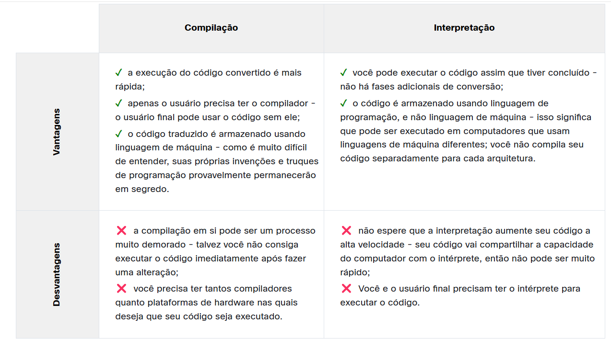

# Introdução a Programação de computadores e Python

## Introdução a Programação

### Linguagens Naturais VS. Linguagens de Programação

Computadores entendem linguagem de máquina.
Conjuntos completos de comandos são chamados de **Lista de instruções(IL)** 

### Linguagem de máquina VS. Linguagem de alto nível

A IL é o **Alfabeto de um linguagem de máquina**.
Linguagens de alto nível são aquelas que permitem as pessoas entender com certa facilidade o que está
sendo escrito para a máquina assim permitindo que as pessoas expressarem comandos que são mais complexos que a
IL oferece.
Programas escritos em linguagens de alto nível é chamado de **código fonte**

### Compilação VS. Interpretação

Existem duas maneira de transformar um programa em linguagem de alto nível para linguagem de máquina:

* **Compilação**: O programa original é convertido uma vez(isso ocorre toda a vez que o código-fonte é alterado)
ao obter um arquivo(um arquivo .exe para códigos executados no ms windows) contendo o código de máquina.
* **interpretação**: traduz o programa toda vez que ele é executado, o **interpretador** faz esse processo

### O que o interpretador faz

Programas são básicamente texto, por isso o código fonte geralmente é colocado em arquivos de texto.
Então o interpretador vai ler esse arquivo, então primeiramente ele irá verificar se a escrita está correta, caso ele encontre um erro ele irá encerrar o processo e retornará uma mensagem de erro.
Ele támbem irá informar onde está o erro e o que o causou (claro nem sempre ele é muito preciso nisso).

### Compilação VS. Intepretação, vantagens e desvantagens

## Introdução ao Python

### Rivais do Python

O Python tem dois concorrentes diretos, com propriedades e predisposições comparáveis. São eles:

* Perl - uma linguagem de script criada originalmente por Larry Wall, uma linguagem mais tradicional e 
conservadora, se parece com algumas linguagens antigas derivadas do C;
* Ruby - uma linguagem de script criada por Yukihiro Matsumoto, uma linguagem inovadora.

### Onde vemos o Python

Ele é muito usado para implementar **serviços de internet** complexos, como mecanismos de pesquisa, 
armazenamento em nuvem e ferramentas, mídias socias e etc.

### Porquê não o python 

Embora python seja bem popular, existem algumas áreas que ele está ausente, como:

* **programação de baixo nível (às vezes chamada de programação "próxima ao metal"):** se você quiser implementar 
um driver ou mecanismo gráfico extremamente eficaz, não usará Python;
* **aplicativos para dispositivos móveis:** embora esse território ainda esteja esperando para ser conquistado 
pelo Python, provavelmente acontecerá algum dia.

# Tipos de dados em python, Váriaveis, operadores e operações I/O básicas

## Seção 1 - O programa Olá Mundo

### Mecanismos de Palavra-Chave

Argumentos de palavra-chave possuem **três** elementos:
* Uma **Palavra-chave** que identifica o argumento;
* Um **Sinal de igual**;
* Um **valor** atribuído a esse argumento.

Qualuer argumento de palavra-chave dever ser o último argumento declarado na função

Podemos usar o "parametro" "END=''" quando queremos alterar o final de uma linha do PRINT()
Podemos usar o "SEP=''" quando quisermos definir como o PRINT deve separar os argumentos recebidos.

## Seção 2 - literais pyhton

Podemos usar a letra 'e' para fazer com que o número seja multiplicado pelo expoente, assim podemos resumir
a escrita de números muito grandes. EX: 3E8.
OBS: o expoente (o valor após o E) tem que ser um número inteiro; a base (o valor na frente do E) pode ser um 
número inteiro ou um valor flutuante.

## Seção 3 - Operadores - ferramentas de manipulação de dados

**OBS: A divisão inteira muitas vezes é chamada tambem de DIVISÃO DE PISO**

## Seção 4 Váriaveis - Caixas em formas de Dados

Convenções para nomes de váriaveis:

* os nomes de variáveis devem estar em letras minúsculas, com palavras separadas por sublinhados para melhorar a legibilidade (por exemplo, var, my_variable)
* nomes de funções seguem a mesma convenção que nomes de variáveis (por exemplo, fun, my_function)
* também é possível usar casos mistos (por exemplo, myVariable), mas apenas em contextos onde esse já é o estilo predominante, para manter a compatibilidade com a convenção adotada.

**Palavras-chave do python:** 'False', 'None', 'True', 'and', 'as', 'assert', 'break', 'class', 'continue', 
'def', 'del', 'elif', 'else', 'except', 'finally', 'for', 'from', 'global', 'if', 'import', 'in', 'is', 
'lambda', 'nonlocal', 'not', 'or', 'pass', 'raise', 'return', 'try', 'while', 'with', 'yield'

# Módulo 3

## Tomada de decisões do Python

### loop for

Na verdade, o for loop for foi projetado para realizar tarefas mais complicadas - ele pode "navegar" em 
grandes coleções de itens de dados por item.

EX:
 for i in range(100):
    # do_something()
    pass 

A invocação da função range() pode ser equipada com dois argumentos, não apenas um:
Nesse caso, o primeiro argumento determina o (primeiro) valor inicial da variável de controle.
O último argumento mostra o primeiro valor em que a variável de controle não será atribuída.
Podemos acrescentar um terceiro argumento que irá dizer ao loop for o valor a se incrementar na váriavel contadora

### Instruções break e continue

* ***break*** - sai do loop imediatamente e termina incondicionalmente a operação do loop; o programa começa a executar a instrução mais próxima após o corpo do loop;
* ***continue*** - se comporta como se o programa tivesse chegado ao fim do corpo; o próximo turno é iniciado e a expressão de condição é testada imediatamente.

### Remover elementos das Listas

Qualquer um dos elementos da lista pode ser removido a qualquer momento - isso é feito com uma instrução chamada **DEL** (delete). ***Nota: é uma instrução, não uma função.***
**EX: del numbers[1]** essa instrução irá deletar o valor na segunda posição da lista

### Os indices negativos são legais

Um elemento com um índice igual a -1 é o último na lista.
Meio que ao invés da gente contar em ordem crescente a gente vai contar na ordem decrescente.

### Funções e Métodos 

Um método é um tipo específico de função - ele se comporta como uma função e se parece com uma função, mas 
difere na maneira em que atua e em seu estilo de invocação.

Um método faz tudo isso, mas também é **capaz de alterar o estado de uma entidade selecionada**.
Um método p**ertence aos dados para os quais trabalha**, enquanto uma f**unção pertence ao código inteiro.**

### Adicionando elementos em uma lista: append() e insert()

O método **append()** cola o valor colocado entre chaves no final da lista indicada.
**EX:list.append(value)**

Já com o método insert, nós podemos escolher em que posição queremos adicionar o item na lista indicada.
**EX:list.insert(index, value)**

## Ordenando listas simples: O algortimo de classificação bubblesort

### A ordenação de bolhas

O Bubblesort é um algoritmo muito simples, fácil de entender, mas infelizmente não muito eficiente. É usado 
muito raramente, e certamente não para listas grandes e extensas.

### Ordenando uma lista

Uma diga para oredenar listas é usar o método **sort()**

## Operações em listas

### Poderes do fatiamento

Uma ***fatia*** é um elemento da sintaxe do Python que permite **fazer uma cópia totalmente nova de uma lista ou de partes de uma lista.**
Ele é usado da seguinte maneira, por exemplo:
list1 = [start:end]

podemos simplificar a escrita do fatiamento escrevendo apenas **list1 = [:3]** isso fará com que 
automaticamente se incluam os itens da lista apartir do elemento [0], o mesmo funciona com o _end_ mas com a
lógica invers a do start.

nós podemos usar esse elemento junto de outros metodos de listas, como o del por exemplo, assim podendo apagar
vários elementos de uma lista de uma vez.
**EX: del list1[1:3]**

### Fatias - indíces nagativos

Se usarmos números negativos o fatiamento usará da lógica contraria dos números positivos, ou seja ao invés
de desconsiderar o ultimo valor (end-1) ele irá adicionar um valor a mais na inclusão (end+1)

### Operadores in e not in

O primeiro deles (in) verifica se um determinado elemento (seu argumento à esquerda) está atualmente 
armazenado em algum lugar dentro da lista (o argumento à direita) - o operador retorna True neste caso.

O segundo (not in) verifica se um determinado elemento (seu argumento à esquerda) está ausente em uma lista - 
o operador retorna True neste caso.

## Listas em Aplicações avançadas

### Listas em Listas

O mesmo efeito pode ser alcançado por meio de uma compreensão de lista, a sintaxe especial usada pelo Python para preencher listas enormes.

Uma compreensão de lista é, na verdade, uma lista, mas criada em andamento durante a execução do programa e não é descrita estaticamente.
**EX: row = [white_pawn for i in range(8)]

### Matrizes Bidimensionais

