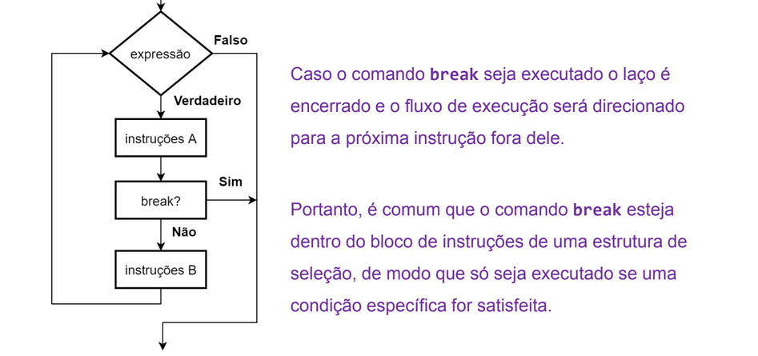
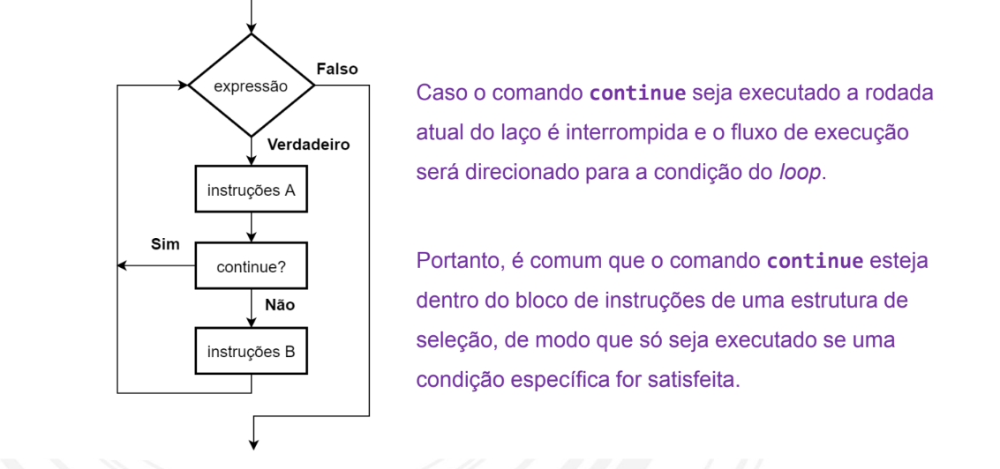

# Falando de Estruturas de repetição

## O que são?

Estruturas de repetição/iterativas/laços de repetição/loops.
Tais estruturas fazem com que bloco de código seja executado várias vezes.

## loop while

O **while** executa seu bloco de código repetidamente enquanto sua expressão de decisão for verdadeira.
Ou seja nem sempre é possível saber de for a antecipada quantas repetições seram executadas.

**Váriavel contadora**: Usada para controlar ou só contar quantas vezes as estruturas de repetição são usadas.

## Váriavel acumuladora

Essa váriavel é usada para acumular valores e não são constantes, seu incremento é variável.

## Comando **BREAK**

Esse comando encerra a execução de um laço de repetição mais interno em que ele está contido

## Comando **CONTINUE**

Esse comando faz com que o fluxo da execução seja deslocado para a estrutura de decisão mais interna no laço de repetição, Ou seja quando o **CONTINUE** é executado ele para a repetição atual e já avança para a próxima.

## Representação da estrutura repita até que...

Em algumas situações nós precisamos que a estrutura de repetição seja executada pelo menos uma vez, assim a verificação que decide se ele será executado ou não deve ficar no **final** do bloco.

[repita até que](repitaAteQue.png)