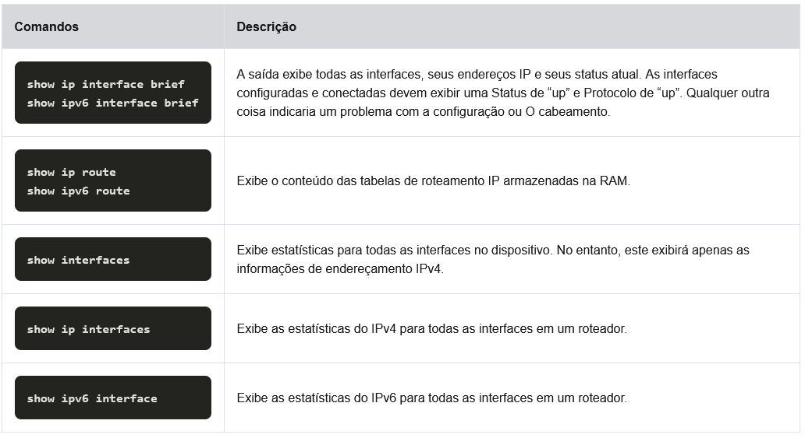

# Configuração básica do roteador

## Configurar definições iniciais do roteador

### Etapas da configuração básica de um roteador

1. configurar o nome do dispositivo

````
Router(config)# hostname hostname
````

2. Proteger o modo EXEC privilegiado

````
Router(config)# enable secret password
````

3. Proteger o Modo EXEC Usuário

````
Router(config)# line console 0  
Router(config-line)# password password  
Router(config-line)# login
````

4. Proteger o acesso remoto Telnet/SSH

````
Router(config-line)# line vty 0 4  
Router(config-line)# password   password  
Router(config-line)# login  
Router(config-line)# transport input {    ssh   | telnet}
````

5. Proteger todas as senhas do arquivo de configuração

````
Router(config-line)# exit  
Router(config)# service password-encryption
````

6. Apresentar a notificação legal

````
Router(config)# banner motd delimiter message delimiter
````

7. Salvar a configuração

````
Router(config)# end  
Router# copy running-config startup-config
````

## Configurar interfaces

### Configurar interfaces do roteador

Isso ocorre porque os roteadores não podem ser acessados por dispositivos finais até que as interfaces estejam configuradas.

A tarefa para configurar uma interface de roteador é muito semelhante a um SVI de gerenciamento em um switch.
````
Router(config)# interface type-and-number  
Router(config-if)# description description-text  
Router(config-if)# ip address  ipv4-address subnet-mask  
Router(config-if)# ipv6 address  ipv6-address/prefix-length  
Router(config-if)# no shutdown
````

Embora o comando description não seja necessário para habilitar uma interface, é recomendável usá-lo.
so pode ser útil na solução de problemas em redes de produção, fornecendo informações sobre o tipo de rede conectada. 
Por exemplo, se a interface se conectar a um provedor de serviços de Internet ou provedor de serviços, o 
comando description seria útil para inserir informações de conexão e contato de terceiros.

O uso do comando no shutdown ativa a interface e é semelhante a ligar a interface. 
A interface também deve ser conectada a outro dispositivo, como switch ou roteador, para que a camada física esteja ativa.
Há vários comandos que podem ser usados para verificar a configuração de uma interface. 
O mais útil deles é o comandos **show ip interface brief e show ipv6 interface brief**.

### Comandos de verificação de configuração



## Configurar o gateway padrão

### Gateway padrão em um host

Se sua rede local tiver apenas um roteador, será o roteador gateway e todos os hosts e switches da rede 
deverão ser configurados com essas informações.
Se sua rede local tiver vários roteadores, você deverá selecionar um deles para ser o roteador de gateway padrão.
Para que um dispositivo final se comunique pela rede, ele deve ser configurado com as informações de endereço IP, incluindo o endereço de gateway padrão. 
**O gateway padrão só é usado quando o host deseja enviar um pacote a um dispositivo em outra rede.**

### Gateway padrão em um switch

Um switch de Camada 2 não precisa de um endereço IP para funcionar corretamente. 
No entanto, uma configuração IP pode ser configurada em um switch para dar acesso remoto a um administrador ao switch.
Para se conectar e gerenciar um switch em uma rede IP local, ele deve ter uma interface virtual de switch (SVI) configurada. 
O SVI é configurado com um endereço IPv4 e uma máscara de sub-rede na LAN local. 
O switch também deve ter um endereço de gateway padrão configurado para gerenciar remotamente o switch de outra rede.

Para configurar um gateway padrão IPv4 em um switch, use o comando de configuração global ip default-gateway ip-address. 
O ip-address que está configurado é o endereço IPv4 da interface do roteador local conectada ao switch.

Um switch de grupo de trabalho também pode ser configurado com um endereço IPv6 em um SVI. 
No entanto, o switch não requer que o endereço IPv6 do gateway padrão seja configurado manualmente. 
O switch receberá automaticamente seu gateway padrão da mensagem de anúncio do roteador ICMPv6 do roteador.