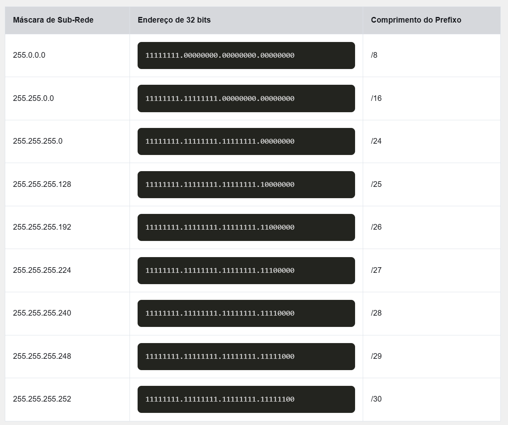
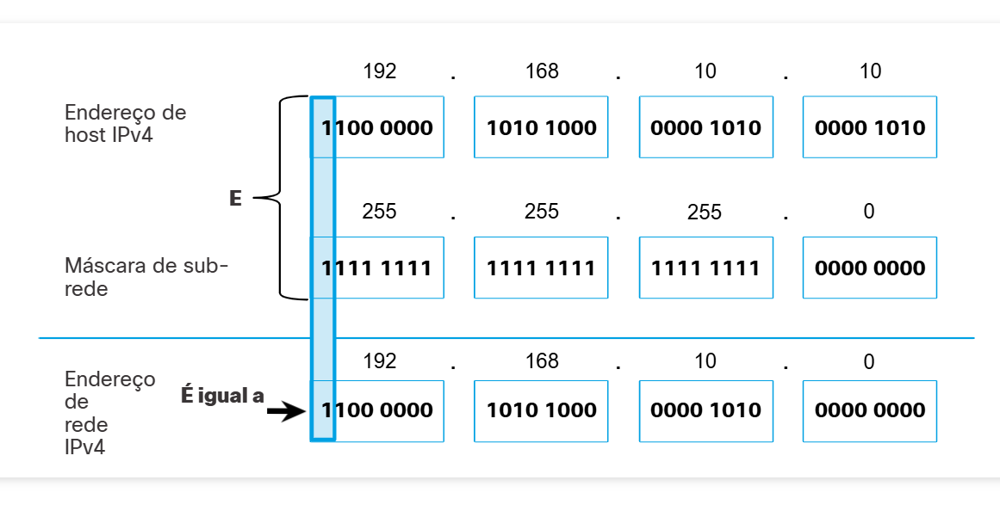
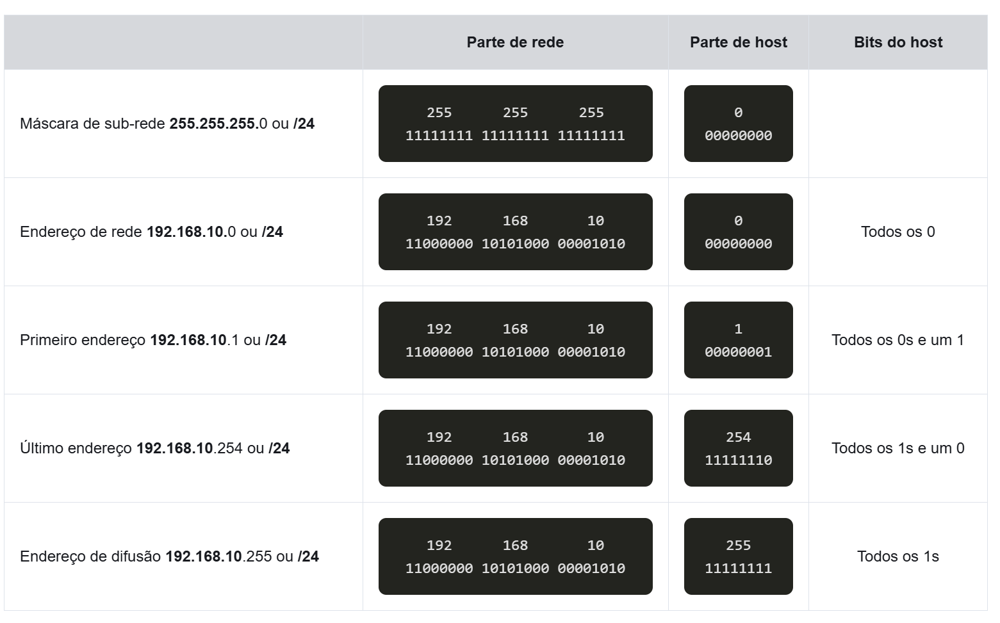
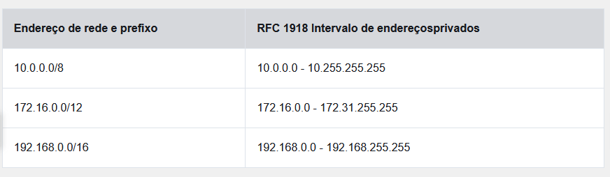

# Endereçamento IPv4

## Estrutura do IPv4

### Partes de Rede e de Host

Os bits na parte de rede do endereço devem ser iguais em todos os dispositivos que residem na mesma rede. 
Os bits na parte de host do endereço devem ser exclusivos para identificar um host específico dentro de uma rede.

### A Máscara de sub-rede

A máscara de sub-rede IPv4 é usada para diferenciar a parte da rede da parte do host de um endereço IPv4. Quando um endereço IPv4 é atribuído a um dispositivo, a máscara de sub-rede é usada para determinar o endereço de rede do dispositivo. 
O endereço de rede representa todos os dispositivos na mesma rede.

Para identificar as partes da rede e do host de um endereço IPv4, a máscara de sub-rede é comparada com o endereço IPv4 bit por bit, da esquerda para a direita.

Observe que, na verdade, a máscara de sub-rede não contém a parte da rede ou host de um endereço IPv4, apenas 
informa ao computador onde procurar a parte do endereço IPv4 que é a parte da rede e qual parte é a parte do host.

O processo real usado para identificar a parte da rede e a parte de host é chamado de AND.

### Comprimento do Prefixo

Expressar os endereços de rede e host, com a máscara, em decimal é uma coisa complexa.
Por isso usamos um método alternativo para identificar uma máscara de sub-rede, um método 
chamado comprimento do prefixo.
O comprimento do prefixo é o número de bits definido como 1 na máscara de sub-rede. 
Está escrito em "notação de barra", que é anotada por uma barra (/) seguida pelo número 
de bits definido como 1. 
Portanto, conte o número de bits da máscara de sub-rede e preceda-o com uma barra.

Ao representar um endereço IPv4 usando um comprimento de prefixo, o endereço IPv4 é 
gravado seguido do comprimento do prefixo sem espaços. 
**Por exemplo, 192.168.10.10 255.255.255.0 seria gravado como 192.168.10.10/24.**

### Determinando a rede - lógica AND

Um AND lógico é uma das três operações booleanas usadas na lógica booleana ou digital. 
As outras duas são OR e NOT. A operação AND é usada para determinar o endereço de rede.
Para identificar o endereço de rede de um host IPv4, é feito um AND lógico, bit a bit, 
entre o endereço IPv4 e a máscara de sub-rede. 
Quando se usa AND entre o endereço e a máscara de sub-rede, o resultado é o endereço de rede.

Usando a primeira sequência de bits como exemplo, observe que a operação E é executada no 
1 bit do endereço do host com o 1 bit da máscara de sub-rede. 
Isso resulta em um bit 1 para o endereço de rede.
A operação AND entre um endereço de host IPv4 e uma máscara de sub-rede resulta no 
endereço de rede IPv4 para este host. 
Neste exemplo, a operação AND entre o endereço de host 192.168.10.10 e a máscara de 
sub-rede 255.255.255.0 (/24) resulta no endereço de rede IPv4 192.168.10.0/24.
***Esta é uma operação IPv4 importante, pois informa ao host a qual rede pertence***

### Endereços de Broadcast, de Host e de Rede

Dentro de cada rede há três tipos de endereços IP:

* Endereço de rede
* Endereços de host
* Endereço de broadcast

#### Endereço de Rede

Um endereço de rede é um endereço que representa uma rede específica. 
Um dispositivo pertence a esta rede se atender a três critérios:

* Tem a mesma máscara de sub-rede que o endereço de rede.
* Ele tem os mesmos bits de rede que o endereço de rede, conforme indicado pela máscara de sub-rede.
* Ele está localizado no mesmo domínio de difusão que outros hosts com o mesmo endereço de rede.

Conforme mostrado na tabela, o endereço de rede tem todos os 0 bits na parte do host, conforme determinado pela máscara de sub-rede. 
Neste exemplo, o endereço de rede é 192.168.10.0/24. 
**Um endereço de rede não pode ser atribuído a um dispositivo.**

#### Endereço de Host

Endereços de host são endereços que podem ser atribuídos a um dispositivo(Pc, celular etc).
Uma parte do host do endereço é os bits indicados por 0 bits na máscara de sub-rede. 
Os endereços de host podem ter qualquer combinação de bits na parte do host, exceto para 
todos os 0 bits (isso seria um endereço de rede) ou todos os 1 bits (isso seria um endereço de difusão).
Todos os dispositivos dentro da mesma rede devem ter a mesma máscara de sub-rede e os mesmos bits de rede. 
**Somente os bits do host serão diferentes e devem ser exclusivos.**

Os endereços 192.168.10.1/24 - 192.168.10.254/24 podem ser atribuídos a um dispositivo na rede.

## Unicast, BroadCast e MultiCast

### Broadcast

Um pacote de broadcast possui um endereço IP de destino com todos os (1s) na parte do host ou 32 (um) bits.
**Note: O IPv4 usa pacotes de difusão. No entanto, não há pacotes de difusão com IPv6.**

Um pacote de difusão deve ser processado por todos os dispositivos no mesmo domínio de difusão. 
Um domínio de difusão identifica todos os hosts no mesmo segmento de rede.
Uma transmissão pode ser direcionada ou limitada. 
Um broadcast direcionado é enviado para todos os hosts em uma rede específica.
Uma broadcast limitado é enviado para 255.255.255.255.

O tráfego broadcast deve ser limitado para não prejudicar o desempenho da rede ou dos dispositivos.

Como os roteadores separam domínios de broadcast, **subdividir as redes pode melhorar seu** 
**desempenho ao eliminar o excesso de tráfego broadcast.**

#### transmissões direcionadas por IP

Além do endereço de transmissão 255.255.255.255, há um endereço IPv4 de transmissão para cada rede.
Chamado de transmissão direcionada, este endereço usa o endereço mais alto na rede, que é 
o endereço onde todos os bits de host são 1s.
Para enviar dados para todos os hosts em uma rede, um host pode enviar um único pacote 
endereçado ao endereço de difusão da rede.
Quando um pacote de difusão direcionada atinge um roteador conectado diretamente à rede de destino, esse 
pacote é transmitido na rede de destino.

### Multicast

Um pacote multicast é um pacote com um endereço IP de destino que é um endereço multicast. 
O IPv4 reservou os endereços 224.0.0.0 a 239.255.255.255 como intervalo de multicast.

Os hosts que recebem pacotes multicast específicos são chamados de clientes multicast. 
Os clientes multicast usam serviços solicitados por um programa cliente para se inscrever no grupo multicast.

**Cada grupo multicast é representado por um único endereço IPv4 multicast de destino.**

Quando um host IPv4 se inscreve em um grupo multicast, o host processa pacotes endereçados tanto a esse 
endereço multicast como a seu endereço unicast alocado exclusivamente.

Protocolos de roteamento, como OSPF, usam transmissões multicast. 

Por exemplo, os roteadores habilitados com OSPF se comunicam entre si usando o endereço multicast OSPF reservado 224.0.0.5. 
Somente dispositivos habilitados com OSPF processarão esses pacotes com 224.0.0.5 como endereço IPv4 de destino. 
Todos os outros dispositivos ignorarão esses pacotes.

## Tipos de endereço IPv4

### Endereços IPv4 públicos e Privados

Alguns endereços IPv4 não podem ser usados para sair para a Internet, e outros são especificamente alocados 
para roteamento para a Internet. 
Alguns são usados para verificar uma conexão e outros são auto-atribuídos.

Endereços IPv4 públicos são endereços roteados globalmente entre os roteadores do provedor de serviços de 
Internet (ISP).
**No entanto, nem todos os endereços IPv4 disponíveis podem ser usados na Internet**
Existem blocos de endereços (conhecidos como endereços privados) que são usados pela maioria das organizações 
para atribuir endereços IPv4 a hosts internos.
**Os endereços IPv4 privados não são exclusivos e podem ser usados internamente em qualquer rede.**

**Observação: Endereços privados são definidos no RFC 1918 e às vezes referido como espaço de endereço RFC 1918.**

### Roteamento para internet

A maioria das redes internas, de grandes empresas a redes domésticas, usa endereços IPv4 privados para 
endereçar todos os dispositivos internos (intranet), incluindo hosts e roteadores.

Os pacotes com um endereço privado devem ser filtrados (descartados) ou traduzidos para um endereço público antes de encaminhar o pacote para um ISP.
O ISP converte um endereço privado para público usando a Conversão de Endereços de Rede (NAT).
O NAT é usado para converter entre endereços IPv4 privados e IPv4 públicos. 
**Isso geralmente é feito no roteador que conecta a rede interna à rede ISP.**

Embora endereços IPv4 são sejam vísiveis por redes exteriores(como a internet), esse tipo de endereço e nem a
NAT são considerados medidas de segurança eficazes.

As organizações que têm recursos disponíveis para a Internet, como um servidor Web, também terão dispositivos 
com endereços IPv4 públicos. 
Esta parte da rede é conhecida como a DMZ (zona desmilitarizada)

### Endereços IPv4 de uso especial

#### Endereços de loopback

Os endereços de loopback (127.0.0.0 / 8 ou 127.0.0.1 a 127.255.255.254) são mais comumente identificados como apenas 127.0.0.1. 
***Esses são endereços especiais usados por um host para direcionar o tráfego para si próprio.***
Por exemplo, ele pode ser usado em um host para testar se a configuração TCP / IP está operacional.

#### Endereços Link Local

Os endereços locais de link (169.254.0.0 / 16 ou 169.254.0.1 a 169.254.255.254) são mais conhecidos como 
endereços de endereçamento IP privado automático (APIPA) ou endereços auto-atribuídos. 
Eles são usados por um cliente DHCP do Windows para auto-configurar no caso de não existirem servidores DHCP disponíveis.
***Endereços de link local podem ser usados em uma conexão ponto a ponto, mas não são comumente usados para esse fim.***

### Endereçamento classfull legado

Em 1981 os endereços IPv4 começaram a ser atríbuidos usando classes (o endereço classful), sendo esses definidos
em três classes A, B ou C. A RFC dividiu os intervalos de unicast em classes específicas da seguinte maneira:

* Classe A (0.0.0.0/8 to 127.0.0.0/8) - Projetado para suportar redes extremamente grandes com mais de 16 milhões de endereços de host. 
A Classe A usou um prefixo fixo /8 com o primeiro octeto para indicar o endereço de rede e os três octetos 
restantes para endereços de host (mais de 16 milhões de endereços de host por rede).

* Classe B (128.0.0.0 /16 - 191.255.0.0 /16) - Projetado para suportar as necessidades de redes de tamanho moderado a grande, com até aproximadamente 65.000 endereços de host.
A Classe B usou um prefixo fixo /16 com os dois octetos de alta ordem para indicar o endereço de rede e os 
dois octetos restantes para endereços de host (mais de 65.000 endereços de host por rede).

* Classe C (192.0.0.0 /24 - 223.255.255.0 /24) - Projetado para suportar redes pequenas com um máximo de 254 hosts. 
A Classe C usou um prefixo fixo / 24 com os três primeiros octetos para indicar a rede e o octeto restante 
para os endereços de host (apenas 254 endereços de host por rede).

**Observação: Há também um bloco multicast de Classe D que consiste em 224.0.0.0 a 239.0.0.0 e um bloco de**
**endereço experimental de Classe E que consiste em 240.0.0.0 - 255.0.0.0.**

Em meados da década de 1990, com a introdução da World Wide Web (WWW), o endereçamento clássico foi obsoleto 
para alocar de forma mais eficiente o espaço de endereços IPv4 limitado. 
A alocação de endereço de classe foi substituída por endereçamento sem classe, que é usado hoje.

**O endereçamento sem classe ignora as regras das classes (A, B, C).**
Endereços de rede IPv4 públicos (endereços de rede e máscaras de sub-rede) são alocados com base no número de 
endereços que podem ser justificados.

## Segmentação de Rede

### Domínios de transmissão e segmentação

Os dispositivos em LANs Ethernet também localizam outros dispositivos usando serviços. 
Um host normalmente adquire sua configuração de endereço IPv4 usando o protocolo DHCP (Dynamic Host 
Configuration Protocol) que envia difusões na rede local para localizar um servidor DHCP.
**Os switches propagam broadcasts por todas as interfaces, exceto a interface em que foram recebidos.**

**Roteadores não propagam broadcasts.**
Quando um roteador recebe um broadcast, ele não o encaminha por outras interfaces.
Portanto, cada interface do roteador se conecta a um domínio de broadcast e as transmissões são propagadas 
apenas dentro desse domínio de broadcast específico.

### Problemas com grandes domínios de BroadCast

**Um grande domínio de broadcast é uma rede que conecta vários hosts.**

Um problema desse tipo de domínio é que os hosts podem gerar broadcasts em excesso e afetar a rede de forma negativa.  
Isso resulta em operações de rede lentas devido à quantidade significativa de tráfego que pode causar e 
operações de dispositivo lentas porque um dispositivo deve aceitar e processar cada pacote de difusão.
A solução é reduzir o tamanho da rede para criar domínios de broadcast menores em um processo denominado divisão em sub-redes. 
**Os espaços de rede menores são chamados de sub-redes.**
Os broadcasts são propagados apenas dentro dos domínios de broadcast menores. 
Portanto, um broadcast em LAN 1 não se propagaria para LAN 2.

**Esta é a base da divisão em sub-redes: usar bits de host para criar sub-redes adicionais.**
***Observação:*** Os termos sub-rede e rede costumam ser usados de maneira intercambiável. A maioria das redes são uma sub-rede de um bloco de endereços maior.

#### Razões para segmentar redes

Além de melhorar o desempenho, permite que o administrador implemente políticas de segurança como, por 
exemplo, quais sub-redes podem ou não se comunicar com quais sub-redes.
Outra razão é que reduz o número de dispositivos afetados pelo tráfego anormal de transmissão devido a 
configurações incorretas, problemas de hardware/software ou intenção mal-intencionada.

Algumas maneiras comuns de separar as redes são
* Por localização
* Por Grupo ou Função
* Tipo de dispositivo

