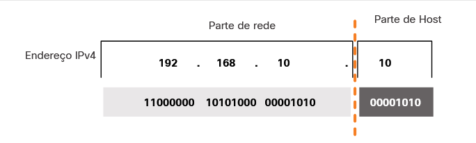
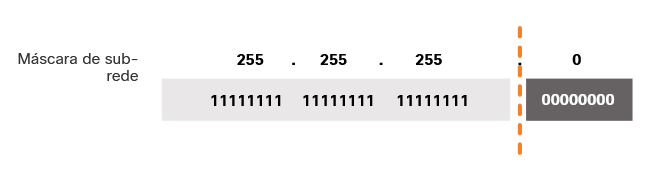

# Endereçamento IPv4

## Estrutura do IPv4

### Partes de Rede e de Host

Os bits na parte de rede do endereço devem ser iguais em todos os dispositivos que residem na mesma rede. 
Os bits na parte de host do endereço devem ser exclusivos para identificar um host específico dentro de uma rede.

### A Máscara de sub-rede

A máscara de sub-rede IPv4 é usada para diferenciar a parte da rede da parte do host de um endereço IPv4. Quando um endereço IPv4 é atribuído a um dispositivo, a máscara de sub-rede é usada para determinar o endereço de rede do dispositivo. 
O endereço de rede representa todos os dispositivos na mesma rede.

Para identificar as partes da rede e do host de um endereço IPv4, a máscara de sub-rede é comparada com o endereço IPv4 bit por bit, da esquerda para a direita.

Observe que, na verdade, a máscara de sub-rede não contém a parte da rede ou host de um endereço IPv4, apenas 
informa ao computador onde procurar a parte do endereço IPv4 que é a parte da rede e qual parte é a parte do host.

O processo real usado para identificar a parte da rede e a parte de host é chamado de AND.

### Comprimento do Prefixo

