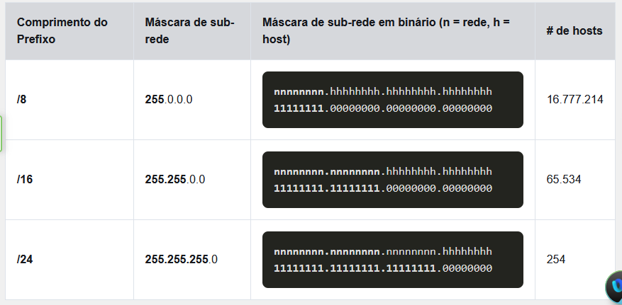
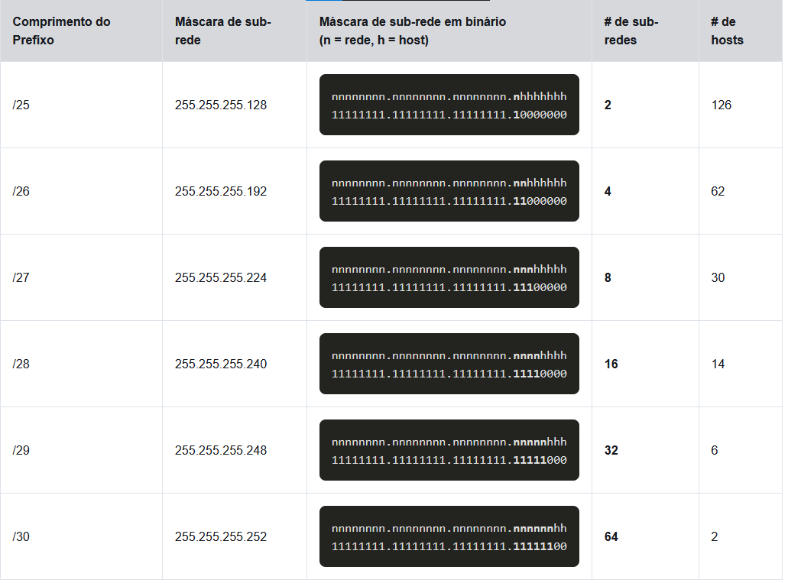

# Endereçamento IPv4

## Sub-rede de uma rede IPv4

### Sub-rede em um limite de octeto

As sub-redes IPv4 são criadas com um ou mais bits de host sendo usados como bits de rede.
Quanto mais bits de host forem emprestados, mais sub-redes poderão ser definidas. 
Quanto mais bits forem emprestados para aumentar o número de sub-redes reduz o número de hosts por sub-rede.
***É mais fácil dividir redes em sub-redes nos limites dos octetos: /8, /16 e /24.***

### Sub-rede dentro de um limite de octeto

Entretanto, as sub-redes podem pedir emprestado bits de qualquer posição dos bits de host para criar outras máscaras.
Por exemplo, um endereço de rede /24 costuma ser dividido em sub-redes usando prefixos mais longos ao pedir 
bits emprestados do quarto octeto.

Cada bit emprestado no quarto octeto, o número de sub-redes disponíveis é dobrado, enquanto reduz o número 
de endereços de host por sub-rede.

## Sub-rede uma barra 16 e um prefixo 8

### Criar sub-redes com o prefixo de barra 16

Em uma situação que exige um número maior de sub-redes, é necessária uma rede IPv4 com mais bits de host 
disponíveis para empréstimo. Por exemplo, o endereço de rede 172.16.0.0 tem uma máscara padrão 255.255.0.0 ou /16. 
Esse endereço tem 16 bits na parte de rede e 16 bits na parte de host. 
Esses 16 bits da parte de host estão disponíveis para serem emprestados na criação de sub-redes

## Divisão de Sub-redes para atender requisitos

### Maximizar endereços IPv4 de host não utilizados e maximizar sub-redes

Para minimizar o número de endereços IPv4 de host não utilizados e maximizar o número de sub-redes disponíveis, há duas considerações ao planejar sub-redes:
**o número de endereços de host necessários para cada rede e o número de sub-redes individuais necessárias.**

## máscara de sub-rede de comprimento variável (VLSM)

### Noções básicas do VLSM

Em casos que sub-redes de uma mesma rede não precisem ter o mesmo número de hosts, o VLSM vem muito a calhar
para resolver esse problema. Nos permitindo assim criar sub-redes com números máximos de hosts diferentes.
O VLSM nos permite dividir sub-redes em sub-redes menores contanto que os espaços de endereço criam, com as
sub-redes que eu crio, não invadam outras sub-redes.

