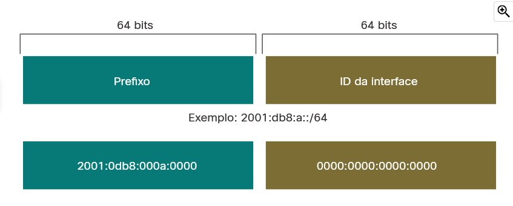
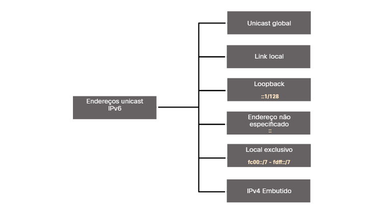
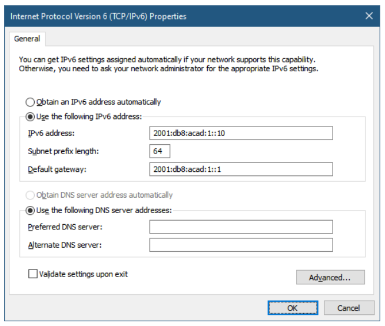

# Endereçamento IPv6

## Problemas do IPv4

### Coexistência do IPv4 e IPv6

Não há uma data exata para migrar para o IPv6. Tanto o IPv4 como o IPv6 coexistirão no futuro próximo. 
A IETF criou vários protocolos e ferramentas para ajudar os administradores de rede a migrarem as redes para IPv6. 
As técnicas de migração podem ser divididas em três categorias:

* Pilha Dupla:
    A pilha dupla permite que IPv4 e IPv6 coexistam no mesmo segmento de rede. 
    Os dispositivos de pilha dupla executam os protocolos IPv4 e IPv6 simultaneamente. 
    Conhecido como IPv6 nativo, isso significa que a rede do cliente tem uma conexão IPv6 com seu ISP e é 
    capaz de acessar o conteúdo encontrado na internet através de IPv6.

* Tunelamento:
    Tunelamento é um método de transporte de pacote IPv6 através de uma rede IPv4. 
    O pacote IPv6 é encapsulado dentro de um pacote IPv4, de forma semelhante a outros tipos de dados.

* Conversão:
    A NAT64 (Network Address Translation 64) permite que os dispositivos habilitados para IPv6 se comuniquem 
    com os dispositivos habilitados para IPv4 usando uma técnica de conversão semelhante à NAT IPv4. 
    Um pacote IPv6 é traduzido para um pacote IPv4 e um pacote IPv4 é traduzido para um pacote IPv6.

**Note: O tunelamento e a tradução são para transição para o IPv6 nativo e só devem ser usados quando**
**necessário. O objetivo deve ser as comunicações IPv6 nativas da origem até o destino.**

## Representação do endereço IPv6

### Formatos de endereço IPv6

Os endereços IPv6 têm 128 bits e são escritos como uma sequência de valores hexadecimais. 
Cada 4 bits são representados por um único dígito hexadecimal, totalizando 32 valores hexadecimais, como mostra a Figura 1. 
Os endereços IPv6 não diferenciam maiúsculas e minúsculas e podem ser escritos tanto em minúsculas como em maiúsculas.

#### Formato preferido

O formato preferencial para escrever um endereço IPv6 é x: x: x: x: x: x: x: x, com cada “x” consistindo de 
quatro valores hexadecimais.
No IPv6, um hexteto é o termo não oficial usado para se referir a um segmento de 16 bits ou quatro valores hexadecimais.
Cada “x” equivale a um único hexteto, 16 bits ou quatro dígitos hexadecimais.

***Existem duas regras que ajudam a reduzir o número de dígitos necessários para representar um endereço IPv6.***

### Regra 1 - otimizar zeros a esquerda

A primeira regra para ajudar a reduzir a notação de endereços IPv6 é omitir os 0s (zeros) à esquerda de 
qualquer seção de 16 bits ou hexteto. 
Aqui estão quatro exemplos de maneiras de omitir zeros à esquerda:

* 01AB pode ser representado como 1AB
* 09f0 pode ser representado como 9f0
* 0a00 pode ser representado como a00
* 00ab pode ser representado como ab

Mais exemplos:

````
prefencial -> 2201 : 0db8 : 0000 : 0000 : 0000 : 0200
nenhum 0 a esquerda -> 2201 : db8 : 0 : 0 : 0 : 200
````

### Regra 2 - dois pontos duplos 

A segunda regra para ajudar a reduzir a notação de endereços IPv6 é que o uso de dois-pontos duplo (::) pode 
substituir uma única sequência contígua de um ou mais segmentos de 16 bits (hextetos) compostos exclusivamente por 0s. 
Por exemplo, 2001:db8:cafe: 1:0:0:0:1 (0s iniciais omitidos) poderia ser representado como 2001:db8:cafe:1::1. 
O dois-pontos duplos (::) é usado no lugar dos três hextets all-0 (0:0:0).
Os dois-pontos em dobro (::) só podem ser usados uma vez em um endereço; caso contrário, haveria mais de um endereço resultante possível. 
Quando associada à técnica de omissão dos 0s à esquerda, a notação de endereço IPv6 pode ser bastante 
reduzida. **É o chamado formato compactado.**

Se um endereço tiver mais de uma cadeia contígua de todos os hextets 0, a prática recomendada é usar dois 
pontos duplos (::) na cadeia mais longa. 
Se as strings forem iguais, a primeira string deve usar dois pontos duplos (::)

Exemplos:
````
prefencial -> 2201 : 0db8 : 0000 : 0000 : 0000 : 0200
comprenssados/espaços -> 2201 : 0db8 :: 0200
````

## Tipos de endereço IPv6

### Unicast, Multicast e Anycast

* **Unicast** - Um endereço IPv6 unicast identifica exclusivamente uma interface em um dispositivo habilitado para IPv6.
* **Multicast** - Um endereço IPv6 multicast é usado para enviar um único pacote IPv6 para vários destinos.
* **Anycast** - Um endereço IPv6 anycast é qualquer endereço IPv6 unicast que possa ser atribuído a vários dispositivos. 
Um pacote enviado a um endereço de anycast é roteado para o dispositivo mais próximo que tenha esse endereço.

Ao contrário do IPv4, o IPv6 não possui um endereço de broadcast. 
No entanto, há um endereço multicast para todos os nós IPv6 que fornece basicamente o mesmo resultado.

### Comprimento de Prefixo IPv6

No IPv4 o /24(por exemplo) é chamado de prefixo. No IPv6 é chamado de comprimento do prefixo. 
O IPv6 não usa a notação decimal com pontos da máscara de sub-rede.
Como o IPv4, o comprimento do prefixo é representado na notação de barra e é usado para indicar a parte da rede de um endereço IPv6.

O comprimento do prefixo pode variar de 0 a 128. 
O comprimento do prefixo IPv6 recomendado para LANs e a maioria dos outros tipos de redes é /64.
EX:



**É altamente recomendável** usar um ID de interface de 64 bits para a maioria das redes. 
Isso ocorre porque a **configuração automática de endereço sem estado (SLAAC)** usa 64 bits para o ID de interface. 
Também facilita a criação e o gerenciamento de sub-redes.

### Outros tipos de endereço IPv6

Semelhante ao IPv4, o endereço IPv6 origem deve ser um endereço unicast. 
O endereço IPv6 destino pode ser um endereço unicast ou multicast. 
A figura mostra os diferentes tipos de endereços unicast IPv6.



Ao contrário dos dispositivos IPv4 que têm apenas um único endereço, os endereços IPv6 normalmente têm dois endereços unicast:


* **Um endereço unicast global(GUA)** - é semelhante a um endereço IPv4 público. São endereços de Internet roteáveis 
e globalmente exclusivos. GUAs podem ser configurados estaticamente ou dinamicamente distribuídos.

* **Endereço LLA (Link-Local Address)** - Isso é necessário para cada dispositivo habilitado para IPv6. Os LLAs 
são usados para se comunicar com outros dispositivos no mesmo link local. No IPv6, o termo **link se refere** a 
**uma sub-rede.** Limitados a um único link. Sua exclusividade só deve ser confirmada nesse link, porque eles não 
são roteáveis além do link. Em outras palavras, os roteadores não encaminham pacotes com um endereço de link 
local origem ou destino.

### Uma observação sobre o endereço Local Exclusivo LLA

**Endereços locais exclusivos (intervalo fc00::/7 a fdff::/7) ainda não são comumente implementados.**

Os endereços IPv6 unique local têm alguma semelhança com endereços privados do RFC 1918 para o IPv4, mas há diferenças significativas:

* Os endereços unique local são utilizados para endereçamento local dentro de um site ou entre um número limitado de sites.
* Os endereços unique local podem ser usados para dispositivos que nunca precisarão ou terão acesso por outra rede.
* Endereços locais exclusivos não são globalmente roteados ou traduzidos para um endereço IPv6 global.

### Estrutura IPv6 GUA

#### Prefixo global de Roteamento

O prefixo global de roteamento é o prefixo (parte de rede) do endereço que é atribuído pelo provedor (como um 
ISP) a um cliente ou um site. 
Por exemplo, o endereço IPv6 2001:db8:acad::/ 48 possui um prefixo de roteamento global que indica que os 
primeiros 48 bits (3 hextets) (2001:db8:acad) são como o ISP conhece esse prefixo (rede). 
Dois-pontos duplo (::) antes do comprimento de prefixo /48 significa que o restante do endereço contém apenas 0s. 
O tamanho do prefixo de roteamento global determina o tamanho da ID da sub-rede.

#### ID da sub-rede

O campo ID de sub-rede é a área entre o Prefixo de roteamento global e o ID da interface.
Ao contrário do IPv4, onde você deve pedir bits emprestados da parte do host para criar sub-redes, o IPv6 foi 
projetado tendo em mente a sub-rede. 
A ID da sub-rede é usada por uma empresa para identificar sub-redes localmente. 
Quanto maior a ID da sub-rede, mais sub-redes disponíveis.

Usando um tamanho típico de prefixo / 64, os quatro primeiros hexteto são para a parte da rede do endereço, 
com o quarto hexteto indicando o ID da sub-rede. 
Os quatro hextetos restantes são para a ID da interface.

#### ID da Interface

A ID da interface IPv6 equivale à parte de host de um endereço IPv4. 
O termo ID da interface é usado porque um único host pode ter várias interfaces, cada uma com um ou mais endereços IPv6.
Uma sub-rede /64 ou prefixo (Prefixo de roteamento global + ID da sub-rede) deixa 64 bits para o ID da interface. 
Isso é recomendado para permitir que dispositivos habilitados para SLAAC criem seu próprio ID de interface de 64 bits. 
Também torna o desenvolvimento de um plano de endereçamento IPv6 simples e eficaz.

***Observação:*** Ao contrário do IPv4, no IPv6 todos os endereços de host apenas com 0s ou apenas com 1s 
podem ser atribuídos a um dispositivo. 
O endereço todos-1s pode ser usado porque os endereços de broadcast não são usados dentro do IPv6. 
O endereço apenas de 0s também pode ser usado, mas é reservado como endereço anycast de roteadores de 
sub-redes e só deve ser atribuído a roteadores.

### IPv6 LLA

Um endereço IPv6 de link-local permite que um dispositivo se comunique com outros dispositivos habilitados 
para IPv6 no mesmo link e somente nesse link (sub-rede). 
Os pacotes com endereço de link local origem ou destino não podem ser roteados além do link de onde o pacote foi originado.

Se um LLA não estiver configurado manualmente em uma interface, o dispositivo criará automaticamente um 
próprio, sem se comunicar com um servidor DHCP
Os hosts habilitados para LLA IPv6 criarão um endereço IPv6 mesmo que não tenha sido atribuído um endereço 
IPv6 unicast global ao dispositivo.
***Normalmente, é o LLA do roteador, não o GUA, que é usado como gateway padrão para outros dispositivos no link.***
Há duas maneiras pelas quais um dispositivo pode obter um LLA:

* **Estaticamente** - Isso significa que o dispositivo foi configurado manualmente.
* **Dinamicamente** - Isso significa que o dispositivo cria seu próprio ID de interface usando valores gerados 
aleatoriamente ou usando o método de Identificador Único Extended (EUI), que usa o endereço MAC do cliente 
juntamente com bits adicionais.

## Configuração estática do GUA e do LLA

### Configuração de GUA estática em um roteador

A maioria dos comandos de configuração e verificação do IPv6 no Cisco IOS são semelhantes aos seus equivalentes no IPv4. 
Em muitos casos, a única diferença é o uso de ipv6 no lugar ip de dentro dos comandos.
O comando Cisco IOS para configurar um GUA IPv6 em uma interface é **ipv6 address _ipv6-address/prefix-length._**
O exemplo mostra os comandos necessários para configurar o IPv6 GUA no GigabitEthernet 0/0/0, GigabitEthernet 
0/0/1 e na interface Serial 0/1/0 do R1.

````
R1(config)# interface GigabitEthernet 0/0/0
R1(config-if)# ipv6 address 2001:db8:acad:1::1/64
R1(config-if)# no shutdown
R1(config-if)# exit
R1(config)# interface GigabitEthernet 0/0/1
R1(config-if)# ipv6 address 2001:db8:acad:2::1/64
R1(config-if)# no shutdown
R1(config-if)# exit
R1(config)# interface serial 0/1/0
R1(config-if)# ipv6 address 2001:db8:acad:3::1/64
R1(config-if)# no shutdown
````
### Configuração GUA estática em um Host Windows



Assim como ocorre no IPv4, a configuração de endereços estáticos em clientes não escala para ambientes maiores. 
Por esse motivo, a maioria dos administradores de redes IPv6 permite a atribuição dinâmica de endereços IPv6.

Há duas maneiras de um dispositivo obter um endereço IPv6 unicast global automaticamente:

* Configuração automática de endereço stateless (SLAAC)
* Com estado DHCPv6

Quando o DHCPv6 ou o SLAAC é usado, o LLA do roteador será especificado automaticamente como o endereço de gateway padrão.

### Configuração de um LLA

A configuração manual do LLA permite criar um endereço reconhecível e fácil de lembrar.
Isso é benéfico porque os LLAs do roteador são usados como endereços de gateway padrão e no roteamento de mensagens de anúncio.
Os LLAS podem ser configurados manualmente usando o comando ipv6 address link-local ipv6-link-local-address.
O exemplo mostra a configuração de um LLA no roteador R1.

````
R1(config)# interface gigabitethernet 0/0/0
R1(config-if)# ipv6 address fe80::1:1 link-local
R1(config-if)# exit
R1(config)# interface gigabitethernet 0/0/1
R1(config-if)# ipv6 address fe80::2:1 link-local
R1(config-if)# exit
R1(config)# interface serial 0/1/0
R1(config-if)# ipv6 address fe80::3:1 link-local
R1(config-if)# exit
````

Os LLAs configurados estaticamente são usados para torná-los mais facilmente reconhecíveis como pertencentes ao roteador R1. 
Neste exemplo, todas as interfaces do roteador R1 foram configuradas com um LLA que começa com fe80::1:n e um 
dígito exclusivo à direita “n”. O “1” representa o roteador R1.
O mesmo LLA pode ser configurado em cada link, desde que seja exclusivo nesse link. 
Isso é possível porque as interfaces de link local só precisam ser exclusivas nesse link. 
No entanto, a prática comum é criar um LLA diferente em cada interface do roteador para facilitar a 
identificação do roteador e da interface específica.
