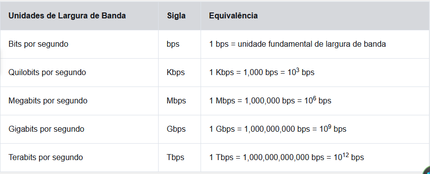

# Camada Física

## Propósito da camada física

### conexão física

Antes que ocorra qualquer conexão em rede primeiro é necessário estabelecer uma conexão física com uma rede local.
Conexões físicas podem ser tanto uma conexão com fio usando um cabo ou uma conexão sem fio usando ondas de rádio
O tipo de conexão física usada depende da configuração de rede. 
Dispositivos em uma rede sem fio precisam estar conectados a um ponto de acesso sem fio (AP) ou roteador sem fio.

#### Placas de interface de rede

As placas de interface de rede(NICs) conectam os dispositivos á rede. 
NICs de Ethernet servem para conexões com fio.
NICs de rede local sem fio (WLANs) servem para conexões sem fio.
Dispositivos finais podem incluir um ou dois tipos de NICs
----------------------------------------------------------------------------------------------------------
**OBS: Nem todas as conexões físicas são iguais, em termos de nível de desempenho, durante uma conexão com uma rede.**

### Camada física

A camada física do modelo OSI fornece os meios os meios de transporte dos bits de um quadro da camada de enlace no meio físico da rede.
Tal camada aceita um quadro completo da camada de enlace e o codifica em uma série de sinais que são transmitidos á mídia local.
Os bits codificados que formam um quadro são recebidos por um dispositivo final ou um dispositivo intermediário.
A camada física codifica os quadros e cria os sinais de onda elétrica, óptica ou de rádio que representam os bits em cada quadro. Esses sinais são então enviados pela mídia, um de cada vez.

## Características da camada física

### Padrões da camada física

A camada física consiste em circuitos eletrônicos, meios físicos e conectores desenvolvidos pelos engenheiros.
Os padrões de hardware, mídia, codificação e sinalização da camada física são definidos e governados por essas organizações de padrões: 

* International Organization for Standardization (ISO)
* Telecommunications Industry Association/Electronic Industries Association (TIA/EIA)
* União Internacional de Telecomunicações (ITU)
* Instituto Nacional de Padronização Americano (ANSI)
* Institute of Electrical and Electronics Engineers (IEEE)
* Autoridades reguladoras de telecomunicações nacionais, incluem Federal Communication Commission (FCC) nos EUA 
* European Telecommunications Standards Institute (ETSI)

### Componentes Físicos

As 3 áreas funcionais abordadas pelos padrões de camada física:

* Componentes Físicos;
* Codificação;
* Sinalização.

#### Componentes Físicos

Componentes físicos = dispositivos de hardware eletrônico, mídia e outros conectores que transmitem os sinais que representam os bits.
Componentes de Hardware = NICs, interfaces e conectores, materiais de cabo e projetos de cabo.
estes são especificados nos padrões associados à camada física.

### Codificação

Codificação/codificação de linha é um método que converte fluxos de bits em um "código" predefinido.
Esses códigos são agrupamentos de bits que fornecem um padrão previsível que pode ser reconhecido pelo emissor e pelo receptor.
Basicamente a codificação é o método ou o padrão usado para representar as informações digitais.

### Sinalização

A camada física deve gerar sinais elétricos, ópticos ou sem fio que representam os valores "0" e "1".
A maneira como os bits são representados é chamada de sinalização.
Os padrões da camada física definem qual tipo de sinal representa "1" e qual representa "0", esse processo pode ser tão simples quanto alterar um nível de um sinal elétrico ou de pulso óptico.

### Largura de Banda

Meios físicos diferentes aceitam a transferência de bits a taxas diferentes.
Largura de Banda = capacidade na qual um meio pode transportar dados.
A largura de banda digital mede a quantidade de dados que podem fluir de um lugar para outro durante um determinado tempo.
A largura de banda é geralmente medida em Kbps, Mbps e Gbps.

Uma combinação de fatores determina a largura de banda prática de uma rede:

* As propriedades do meio físico
* As tecnologias escolhidas para sinalização e detecção de sinais de rede

### Terminologia de Largura de Banda

Termos usados para medir a qualidade da largura de banda:

* Latência;
* Rendimento;
* Dados úteis.

#### Latência 

latência = tempo necessário para os dados viajarem de um ponto a outro, incluindo atrasos.
Em uma internetwork ou em uma rede com vários segmentos, a taxa de transferência não pode ser mais rápida que o link mais lento no caminho da origem ao destino.
Ou seja mesmo que todos os segmentos tenham uma banda larga, apenas um segmento no caminho com uma taxa baixa de tranferência pode desalerar tudo.

#### Taxa de Transfêrencia 

taxa de transfêrencia = medida da transferência de bits através da mídia durante um determinado período.
Geralmente a taxa de transferencia não corresponde á largura de banda que foi específicada na camada física.
A taxa de transfêrencia geralmente é menor que a largura de banda.
Fatores que influênciam essa taxa.

* A quantidade de tráfego;
* O tipo de tráfego;
* A latência criada pelo número de dispositivos de rede encontrados entre a origem e o destino.

#### Dados Úteis

GoodPut = a medida de dados usáveis transferidos em um determinado período, Goodput é a taxa de transferência menos a sobrecarga de tráfego para estabelecer sessões, reconhecimentos, encapsulamento e bits retransmitidos.
O GoodPut é sempre menor que a taxa de transfêrencia.

## Cabeamento de Cobre

### Características do cabeamento de cobre

Esse tipo de cabeamento é _o mais comumente usado nas redes hoje_.
Existem 3 tipos de cabo de cobre que são usados em situações específicas.
As redes usam mídia de cobre porque **é barata, fácil de instalar, baixa resistência à corrente elétrica**.
Os dados são transmitidos por **pulsos elétricos**.
Quanto mais o sinal viajar **mais ele irá se deteriorar**, isso se chama atenuação de sinal.
Cabeamentos de cobre devem seguir limitações rígidas de distâncias.

A temporização e a voltagem dos pulsos elétricos também são suscetíveis à interferência de duas fontes:

* **Interferência eletromagnética (EMI) ou interferência de radiofrequência (RFI)** - Os sinais EMI e RFI podem distorcer e corromper os sinais de dados que estão sendo transportados pela mídia de cobre. Possíveis fontes de EMI e RFI são dispositivos de ondas de rádio e eletromagnéticos, como luzes fluorescentes ou motores elétricos.
* **Diafonia** - Diafonia é uma perturbação causada pelos campos elétrico ou magnético de um sinal em um fio para o sinal em um fio adjacente. Nos circuitos de telefone, a diafonia pode fazer com que parte de outra conversa de voz de um circuito adjacente seja ouvida (linha cruzada). Especificamente, quando uma corrente elétrica flui através de um cabo, ela cria um pequeno campo magnético circular ao redor do cabo, que pode ser captado por um cabo adjacente.

Para contrabalançar os efeitos negativos da EMI e da RFI, alguns tipos de cabos de cobre têm proteção metálica e exigem conexões devidamente aterradas.
Para contrabalançar os efeitos negativos do crosstalk, alguns tipos de cabos de cobre têm pares de cabos de circuitos opostos juntos, o que efetivamente cancela o crosstalk.

A suscetibilidade dos cabos de cobre ao ruído eletrônico também pode ser limitada usando estas recomendações:

* Selecionando o tipo ou categoria de cabo mais adequado para um determinado ambiente de rede
* Projetar uma infraestrutura de cabos para evitar fontes conhecidas e potenciais de interferência na estrutura do edifício
* Usando técnicas de cabeamento que incluem o manuseio e a terminação adequados dos cabos

### Tipos de cabeamento de cobre

Há três tipos de mídias de cobre usadas em redes.
* Cabo de Par trançado não blindado (UTP)
* Cabo de Pares Trançados Blindados (STP)
* Cabo Coaxial 

#### UTP

O UTP é o meio físico de rede mais comum. Este cabeamento terminado com conectores RJ-45, **é usado para interconectar hosts de rede com dispositivos de rede intermediários**, como comutadores e roteadores.
Em LANs o cabo UTP consiste em quatro pares de cabos codificados por cores que foram trançados e depois colocados em uma capa plástica flexível que protege contra danos físicos menores.
Trançar cabos ajuda na proteção contra interferência de sinais de outros cabos.
os códigos de cores identificam os pares e cabos individuais e ajudam na terminação do cabo.

Os números na figura identificam algumas características-chave do cabo de par trançado não blindado:

1. A capa externa protege os fios de cobre contra danos físicos.
2. Os pares trançados protegem o sinal contra interferências.
3. O isolamento plástico com código de cores isola eletricamente os fios um do outro e identifica cada par.

#### STP

O STP oferece mais proteção contra ruído do que o UTP. Mas o STP é bem mais caro e mais difícil de instalar que o UTP.
O STP também usa conectores RJ-45.
O STP combina as técnicas de blindagem para contrabalançar a EMI e a RFI, e são trançados para conter o crosstalk.
Os cabos STP são terminados com conectores de dados blindados especiais para aproveitar totalmente a blindagem.
Caso o cabo não esteja devidamente aterrado, a **blindagem poderá atuar como uma antena e captar sinais indesejados.**
O cabo STP mostrado usa quatro pares de cabo, envolvidos em blindagens, que são colocados em uma proteção ou revestimento geral metálico.

Os números na figura identificam algumas características chave do cabo de par trançado blindado:

1. Revestimento exterior
2. Escudo trançado ou laminado
3. Escudos de alumínio
4. Pares trançados

#### Cabo Coaxial

O coax, recebe esse nome pois tem dois condutores que compartilham o mesmo eixo.
O cabo coaxial consiste no seguinte:

* Um condutor de cobre é usado para transmitir os sinais eletrônicos.
* Uma camada de isolamento plástico flexível envolve um condutor de cobre.
* O material de isolamento é envolvido em uma malha de cobre com tecido, ou uma folha metálica, que atua como o segundo cabo no circuito e uma proteção para o condutor interno. Essa segunda camada, ou blindagem, também reduz a quantidade de interferência eletromagnética externa.
* Todo o cabo é coberto com um revestimento para evitar danos físicos menores.

Há diferentes tipos de conectores usados no coax.
No geral o cabo UTP substituiu o cabo coax nas modernas instalações de Ethernet, o cabo coax ainda encontra seu uso nas seguintes situações:

* **Instalações sem fio** - Os cabos coaxiais conectam antenas a dispositivos sem fio. O cabo coaxial transporta a energia de radiofrequência (RF) entre as antenas e o equipamento de rádio.
* **Instalações de Internet a cabo** - Os provedores de serviços a cabo fornecem conectividade à Internet para seus clientes, substituindo partes do cabo coaxial e suportando elementos de amplificação por cabo de fibra óptica. No entanto, o cabeamento dentro das instalações do cliente ainda é coaxial.

Os números na figura identificam algumas características chave do cabo coaxial:

1. Revestimento exterior
2. Blindagem de cobre trançado
3. Isolante em plástico
4. Condutor de cobre

## Cabeamento UTP

### Propriedades do UTP

Quando usado como meio de rede, o cabeamento UTP consiste em quatro pares de fios de cobre com código de cores que foram torcidos juntos e depois envoltos em uma bainha de plástico flexível. Seu tamanho reduzido pode ser vantajoso durante a instalação.
O UTP não blindagem para contrabalançar os efeitos de EMI e RFI. Na verdade foram descobertas outras maneiras de limitar o efeito negativo da diafonia:

* **Cancelamento** - os designers agora emparelham os fios em um circuito. Quando dois fios de um circuito elétrico são colocados próximos um do outro, seus campos magnéticos serão opostos. Assim, os dois campos magnéticos cancelam um ao outro e também podem cancelar sinais externos de EMI e RFI.
* **Variando o número de torções por par de fios** - Para aumentar ainda mais o efeito de cancelamento de fios de circuito emparelhados, os projetistas variam o número de torções de cada par de fios em um cabo. O cabo UTP deve seguir especificações precisas que orientam quantas tranças são permitidas por metro (3,28 pés) do cabo. Observe na figura que o par laranja/laranja e branco é menos trançado do que o par azul/azul e branco. Cada par colorido é trançado um número de vezes diferente.

O UTP depende exclusivamente do cancelamento oferecido pelos pares de fios trançados para limitar a degradação de sinal e fornecer efetivamente a autoblindagem para cabos trançados na mídia de rede.

### Padrões e conectores de Cabeamento UTP

O cabeamento de UTP está em conformidade com os padrões estabelecidos conjuntamente pela TIA/EIA Especificamente, o TIA/EIA-568.
As características elétricas do cabeamento de cobre são definidas pelo Instituto de Engenharia Elétrica e Eletrônica (IEEE). 
O IEEE classifica o cabeamento UTP de acordo com o desempenho. Os cabos são colocados nas categorias, com base na capacidade de transportar taxas de largura de banda mais altas.
Os cabos em categorias mais altas são desenvolvidos e construídos para suportar taxas de dados mais elevadas.
três categorias de cabo UTP:

* A categoria 3 foi originalmente utilizada para comunicação de voz através de linhas de voz, mas mais tarde utilizada para transmissão de dados.
* As categorias 5 e 5e são utilizadas para a transmissão de dados. Categoria 5 suporta 100Mbps e Categoria 5e suporta 1000 Mbps.
* A categoria 6 tem um separador adicional entre cada par de fios para suportar velocidades mais altas. * Categoria 6 suporta até 10 Gbps.
* Categoria 7 também suporta 10 Gbps.
* Categoria 8 suporta 40 Gbps.

### Cabos UTP Diretos e Cruzados

Situações diferentes podem necessitar que os cabos UTP sejam conectados com convenções diferentes de fiação.
Isso significa que os fios individuais do cabo precisam ser conectados em ordem diferente para conjuntos diferentes de pinos nos conectores RJ-45.

Estes são os principais tipos de cabo obtidos com o uso de convenções de cabeamento específicas:

* **Ethernet direta** - O tipo mais comum de cabo de rede. Geralmente é usado para interconectar um host a um switch e um switch a um roteador.
* **Ethernet Crossover** - Um cabo usado para interconectar dispositivos semelhantes. Por exemplo, para conectar um switch a um switch, um host a um host ou um roteador a um roteador. No entanto, os cabos cruzados agora são considerados legados, pois as NICs usam o cruzamento de interface dependente médio (Auto-MDIX) para detectar automaticamente o tipo de cabo e fazer a conexão interna.

Usar um cabo crossover ou direto da forma errada, não danifica os dispositivos, mas a conectividade e a comunicação entre os dispositivos não ira ocorrer. Esse é um tipo de erro comum e verificar se as conexões do dispositivo estão corretas é a primeira ação a ser tomada, para a solução de problemas envolvendo conectividade não alcançada

