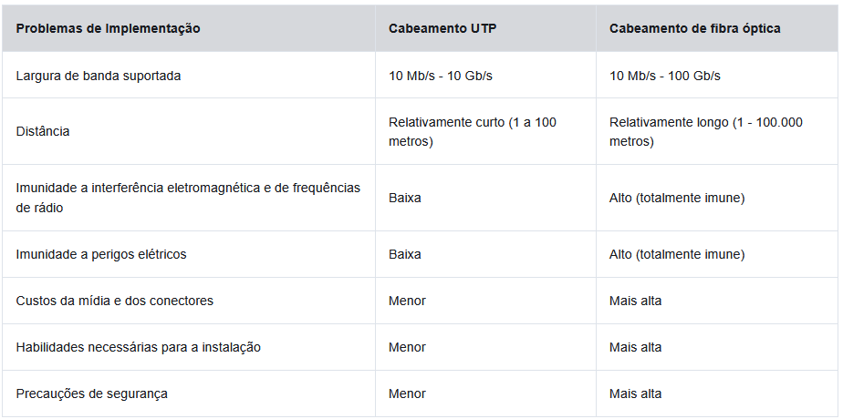

# Camada Física 4.5 em diante

## Cabeamento de Fibra Óptica

O cabeamento de Fibra Óptica não é tão usado nos diversos tipos de cabeamentos de cobre devido ao seu alto custo. 
O cabo de fibra óptica transmite dados por longas distâncias e a larguras de banda mais altas do que qualquer outra mídia de rede. Ao contrário dos fios de cobre, o cabo de fibra óptica transmite sinais com menos atenuação e é completamente imunidade aos EMI e RFI.
Esse tipo de cabo é muito usado para interconectar dispositivos de rede.
A fibra óptica é um fio flexível, extremamente fino e transparente de vidro muito puro.
Os bits são codificados na fibra como pulsos de luz. O cabo de fibra óptica atua como um guia de onda, ou “tubo de luz”, para transmitir luz entre as duas extremidades com o mínimo de perda do sinal.

## Tipos de Fibra

Os cabos de fibra óptica são amplamente classificados em dois tipos:

* Fibra monomodo (SMF)
* Fibra multimodo (MMF)

Uma das diferenças destacadas entre MMF e SMF é a quantidade de dispersão. O termo dispersão se refere ao espalhamento do pulso de luz com o tempo. Maior dispersão significa aumento da perda de força do sinal. MMF tem uma dispersão maior do que SMF. É por isso que o MMF só pode viajar até 500 metros antes da perda de sinal.

### Fibra Monomodo

Este cabo consiste em um núcleo muito pequeno e usa a tecnologia laser cara para enviar um único raio de luz.
O SMF é popular em situações de longa distância que se estendem por centenas de quilômetros, como os exigidos em aplicações de telefonia de longo curso e TV a cabo.

### Fibra Multimodo

Este cabo consiste em um núcleo maior e usa emissores de LED para enviar pulsos de luz. Especificamente, a luz de um LED entra na fibra multimodo em diferentes ângulos.
Popular nas LANs porque pode ser acionada por LEDs de baixo custo. Ela fornece largura de banda até 10 Gb/s por links de até 550 metros.

## Uso de cabeamento de fibra óptica

O cabeamento de fibra é usado em quatro setores:

* **Redes corporativas** - Usadas para aplicativos de cabeamento de backbone e dispositivos de infraestrutura de interconexão.
* **FTTH (Fiber-to-the-Home)** - Usado para fornecer serviços de banda larga sempre ativos para residências e pequenas empresas.
* **Redes de longo curso** - Utilizadas por provedores de serviços para conectar países e cidades.
* **Redes de cabos submarinos** - Utilizadas para fornecer soluções confiáveis de alta velocidade e alta capacidade, capazes de sobreviver em ambientes submarinos adversos até distâncias transoceânicas. Pesquise na internet por “mapa de telegeografia de cabos submarinos” para visualizar vários mapas on-line.

## Conectores de Fibra óptica

As principais diferenças entre os tipos de conectores são as dimensões e os métodos de acoplamento.

**OBS: Alguns switches e roteadores têm portas que suportam conectores de fibra óptica por meio de um transceptor SFP (Small Form Factor Pluggable). Pesquise na internet para vários tipos de SFPs.**

### Conectores de ponta reta (Straight-Tip - ST)

Os conectores ST foram um dos primeiros tipos de conectores usados. O conector trava firmemente com um mecanismo do tipo baioneta “Twist-on / twist-off”

### Conectores SC (Conectores de Assinante)

Esses conectores tambem são conhecidos como conectores quadrados ou conectores padrões. Eles são um conector LAN e WAN amplamente adotado que usa um mecanismo push-pull para garantir uma inserção positiva. Esse tipo de conector é usado com fibra multimodo e monomodo.

### Conectores Lucent (LC) Simplex

Os conectores LC simplex são uma versão menor do conector SC. Às vezes, eles são chamados de conectores pequenos ou locais e estão crescendo rapidamente em popularidade devido ao seu tamanho menor.
-------------------------------------------------------------------------------------------------------

Até recentemente a luz na fibra viajava somente em uma direção. D*uas fibras foram necessárias para suportar a operação full duplex. Portanto, os cabos de conexão de fibra óptica agrupam dois cabos de fibra óptica e os terminam com um par de conectores padrão de fibra única.
Alguns conectores de fibra aceitam fibras de transmissão e de recepção em um único conector, conhecido como conector duplex.

## Cabos de Conexão de Fibra

Os cabos de Fibra são necessários para interconectar dispositivos de infraestrutura.
O uso das cores diferencia entre cabos monomodo e multimodo. A cor amarela indica cabos de fibra monomodo e o laranja é para cabos de fibra multimodo.
Alguns tipos de cabo:
* Cabo multimodo SC-SC;
* Cabo monomodo LC-LC;
* Cabo multimodo ST-LC;
* Cabo monomodo SC-ST;

**OBS: Os cabos de fibra devem ser protegidos com uma pequena tampa de plástico quando não estiverem em uso.**

## Fibra VS. Cobre

Atualmente, na maioria dos ambientes empresariais, a fibra óptica é usada principalmente como cabeamento de backbone para conexões ponto a ponto de alto tráfego entre instalações de distribuição de dados.
Ele também é usado para a interconexão de edifícios em campus multi-construção. Como os cabos de fibra ótica não conduzem eletricidade e têm uma baixa perda de sinal, eles são adequados para esses usos.

**OBS: cabeamento BACKBONE = é o conjunto de cabos de alta capacidade que interliga os principais pontos de uma rede, como salas de telecomunicações, salas de equipamentos e instalações de entrada**

# Meios Sem Fio

## Propriedades do Meio sem Fio

A conexão sem fio transporta sinais eletromagnéticos que representam os dígitos binários de comunicações de dados usando frequências de rádio ou de micro-ondas.
Esse tipo de mídia oferece as melhores opções de mobilidade entre as mídias, vale ressaltar que o número de dispositivos sem fio está em constante aumento. Atualmente a rede sem fio é a principal maneira de se conectar a redes domésticas e corporativas.

Algumas limitações da rede sem fio

* **Área de cobertura** - As tecnologias de comunicação de dados sem fio funcionam bem em ambientes abertos. No entanto, alguns materiais de construção utilizados em prédios e estruturas, e o terreno local, limitarão a eficácia da cobertura.
* **Interferência** - A conexão sem fio é suscetível a interferências e pode ser interrompida por dispositivos comuns, como telefones sem fio domésticos, alguns tipos de luzes fluorescentes, fornos de microondas e outras comunicações sem fio.
* **Segurança** - A cobertura de comunicação sem fio não requer acesso a uma parte física da mídia. Portanto, os dispositivos e usuários que não estão autorizados a acessar a rede podem obter acesso à transmissão. A segurança da rede é o principal componente da administração de uma rede sem fio.
* **AS WLANs e os meios compartilhadosCabos de conexão de fibra** - Operam em half-duplex, o que significa que apenas um dispositivo pode enviar ou receber por vez. O meio sem fio é compartilhado com todos os usuários sem fio. Muitos usuários acessando a WLAN simultaneamente resultam em largura de banda reduzida para cada usuário.

## Tipos de Meio Físico sem Fio

Em cada padrão, as especificações da camada física são aplicadas a áreas que incluem o seguinte:

* Codificação de dados para sinal de rádio;
* Frequência e potência de transmissão;
* Requisitos de recepção e decodificação de sinal;
* Projeto e construção de antenas.

Estes são os padrões sem fio:

* **Wi-Fi (IEEE 802.11)** - Tecnologia de LAN sem fio (WLAN), geralmente chamada de Wi-Fi. A WLAN usa um protocolo baseado em contenção conhecido como acesso múltiplo / detecção de colisão de portadora (CSMA / CA). A NIC sem fio deve ouvir primeiro, antes de transmitir, para determinar se o canal de rádio está limpo. Se houver outro dispositivo sem fio transmitindo, a NIC deverá esperar até o canal estar limpo. Wi-Fi é uma marca comercial registrada da Wi-Fi Alliance. O Wi-Fi é usado com dispositivos WLAN certificados com base nos padrões IEEE 802.11.
* **Bluetooth (IEEE 802.15)** - Este é um padrão de rede pessoal sem fio (WPAN), comumente conhecido como “Bluetooth”. Ele usa um processo de emparelhamento de dispositivo para se comunicar em distâncias de 1 a 100 metros.
* **WiMAX (IEEE 802:16)** - Comumente conhecido como Interoperabilidade mundial para acesso por microondas (WiMAX), esse padrão sem fio usa uma topologia ponto a multiponto para fornecer acesso à banda larga sem fio.
* **Zigbee (IEEE 802.15.4)** - Zigbee é uma especificação usada para comunicações de baixa taxa de dados e baixa potência. Destina-se a aplicações que exigem taxas de dados de curto alcance, baixas e longa duração da bateria. Zigbee é normalmente usado para ambientes industriais e de Internet das Coisas (IoT), como interruptores de luz sem fio e coleta de dados de dispositivos médicos.

## LAN sem fio

Uma implementação comum de dados sem fio permite que dispositivos se conectem sem fio por meio de uma LAN. Em geral, uma WLAN requer os seguintes dispositivos de rede:

* **Ponto de acesso sem fio (AP)** - Estes concentram os sinais sem fio dos usuários e se conectam à infraestrutura de rede existente baseada em cobre, como Ethernet. Os roteadores sem fio domésticos e de pequenas empresas integram as funções de um roteador, comutador e ponto de acesso em um dispositivo.
* **Adaptadores de NIC sem fio** - fornecem recursos de comunicação sem fio para hosts de rede.

Com o seu desenvolvimento, surgiram diversos padrões baseados Ethernet WLAN. Ao comprar dispositivos sem fio, **garanta compatibilidade e interoperabilidade**.

Podemos ver que alguns dos benefícios da comunicação sem fio seriam: economia nos custos de fiação local e a conveniência da mobilidade de host.
Os administradores desse tipo de rede devem implementar medidas rigorosas para impedir acesso e danos não autorizados ás WLANs.