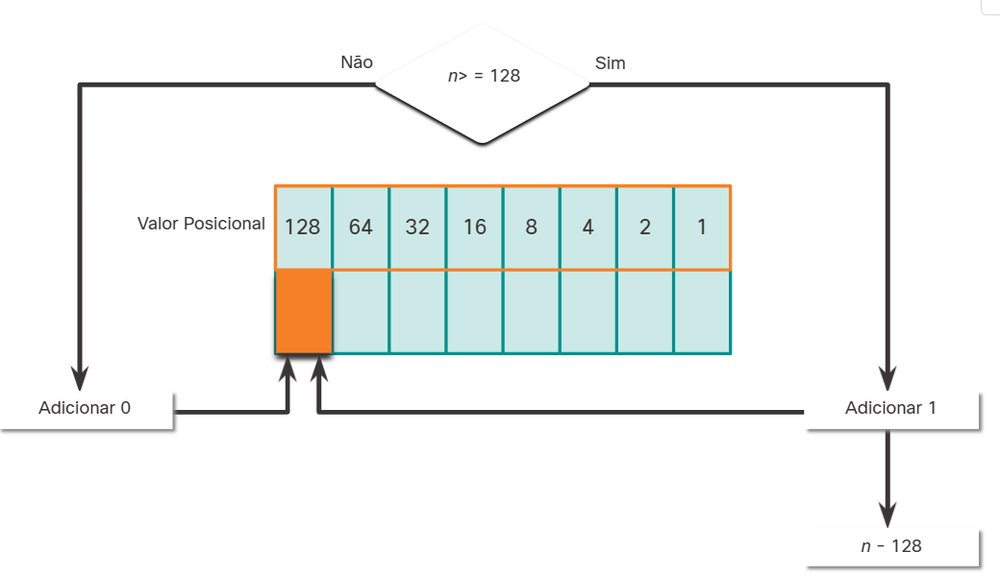

# Sistemas de Números 

## Sistema de numeração binário

### Endereços Binários e IPv4

Os endereços IPv4 começam como binários, uma série de apenas 1s e 0s. Para facilitar o gerenciamento desses endereços os administradores de rede os convertem para decimal.
É importante compreender o binário porque hosts, servidores e dispositivos de rede **usam esse tipo de endereçamento**. Especificamente, eles usam endereços IPv4 binários.
É importante compreender o binário porque hosts, servidores e dispositivos de rede usam esse tipo de endereçamento. Especificamente, eles usam endereços IPv4 binários.

### Uma forma de pensar na conversão binária

Uma forma de pensar nessa conversão de binário para decimal, seria apenas pensar no valor que aquela casa binária tem, e depois ir somando os valores necessários para chegar ao valor decimal desejado. **Por Exemplo**:

caso desejemos transformar o valor 168 para binário, poderiamos pensar assim.

2^7 | 2^6 | 2^5 | 2^4 | 2^3 | 2^2 | 2^1 | 2^0 |
----|-----|-----|-----|-----|-----|-----|-----|
128 | 64  | 32  | 16  | 8   | 4   | 2   | 1   |
1   | 0   | 1   | 0   | 1   | 0   | 0   | 0   |

128 + 32 + 8 = 168.

E caso queiramos fazer o processo inverso, basta conectar os binários as suas respectivas casas e realizar a soma.
vamos transformar o agora o número binário 01101101 em decimal

2^7 | 2^6 | 2^5 | 2^4 | 2^3 | 2^2 | 2^1 | 2^0 |
----|-----|-----|-----|-----|-----|-----|-----|
128 | 64  | 32  | 16  | 8   | 4   | 2   | 1   |
0   | 1   | 1   | 0   | 1   | 1   | 0   | 1   |

64 + 32 + 8 + 4 + 1 = 109

Então seguindo essa lógica para convertermos um endereço IP, nós dividimos ele em Octetos (conjuntos de 8 bits) e seguimos essa lógica apresentada acima. Básicamente **SOME OS 1s!!!**

### Convertendo Decimal para Binário

Primeiro a gente se pergunta se o número decimal do octeto(n) é igual ou superior ao bit mais significativo(128)?

Aí nós seguimos a seguinte lógica

if n < decimal_bit:
    acrescente 0 na casa binária
elif n > decimal_bit:
    acrescente 1 na casa binária
    n - decimal_bit

## Sistema de Numeração Hexadecimal

Para mexermos com IPv6 precisamos entender o hexadecimal pois é assim que interpretamos esse tipo de IP.
Hexadecimal é um sistema de dezesseis bases. O sistema numérico de dezesseis base usa os dígitos 0 a 9 e as letras A a F.

[Tabela](../imagens/tblBases2_10_16.png)

Binário e hexadecimal funcionam bem juntos, O sistema de numeração hexadecimal é usado em rede para representar endereços IP versão 6 e endereços MAC Ethernet.

Os endereços IPv6 têm 128 bits de comprimento e a cada 4 bits é representado por um único dígito hexadecimal; para um total de 32 valores hexadecimais. Os endereços IPv6 não diferenciam maiúsculas e minúsculas e podem ser escritos tanto em minúsculas como em maiúsculas.

Conforme mostrado na figura, o formato preferido para escrever um endereço IPv6 é x:x:x:x:x:x:x:x, com cada "x" consistindo em quatro valores hexadecimais.

No IPv6, hextet é o termo não oficial usado para se referir a um segmento de 16 bits ou quatro valores hexadecimais. Cada "x" é um único hextet, 16 bits ou quatro dígitos hexadecimais.

**4 digitos hexadecimais = 16 digitos binários**

## convertendo hexadecimal pra decimal

Aqui a gente pode fazer algo parecido seguindo a lógica da conversão binário pra decimal, ou seja podemos usar o valor de lugar ou a notação posicional.

convertendo o número hexadecimal 2A para decimal

Tabela:

16^3 | 16^2 | 16^1 | 16^0 |
-----|------|------|------|
4096 | 256  | 16   | 1    | 
-----|------| 2    | A    |

Multiplique os valores da segunda linha pelo da terceira, depois some os resultados, ou seja
(2 x 16) + (A x 1)
(2 x 16) + (10 x 1) 
**Lembre-se: Caso aja alguma letra aí no meio, passe ela para o seu equivalente decimal**

Agora vamos para o caminho oposto, vamos converter 197 para hexadecimal primeiro a gente converte esse decimal para um binário com 8-bits.

2^7 | 2^6 | 2^5 | 2^4 | 2^3 | 2^2 | 2^1 | 2^0 |
----|-----|-----|-----|-----|-----|-----|-----|
128 | 64  | 32  | 16  | 8   | 4   | 2   | 1   |
1   | 1   | 0   | 0   | 0   | 1   | 0   | 1   |

197 = 11000101

Agora vamos converter esse binário para hexadecimal, primeiro a gente pega esse binário, e divide ele em grupos de 4 digitos.
11000101 = 1100 - 0101 

Agora colocamos esses binários de volta naquela nossa tabela

2^3 | 2^2 | 2^1 | 2^0 |
----|-----|-----|-----|
8   | 4   | 2   | 1   |
0   | 1   | 0   | 1   |
1   | 1   | 0   | 0   |

Aí a gente converte esses binários para hexadecimal, e busca os respectivos valores hexadecimais de cada um.
1100 = 8+4 = 12 ----> Hex C
0101 = 4+1 = 5  ----> Hex 5
Ou seja 197 = 0xC5 ou só C5 pra abreviar