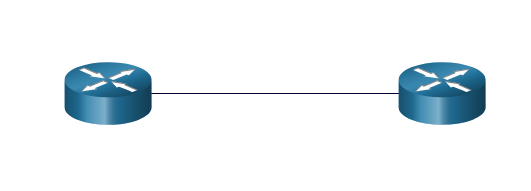

# Camada de enlace

## Finalidade da camada de enlace

### A camada de enlace 

A camada de enlace **prepara os dados da rede para a rede física**. Também é _responsável pela placa de interface de rede (NIC) para comunicações de placa de interface de rede_. 
A camada de enlace de dados faz o seguinte:

* Permite que as camadas superiores acessem a mídia. O protocolo de camada superior não está completamente ciente do tipo de mídia que é usado para encaminhar os dados.
* Aceita dados, geralmente pacotes de Camada 3 (ou seja, IPv4 ou IPv6), e os encapsula em quadros da Camada 2.
* Controla como os dados são colocados e recebidos na mídia.
* Troca quadros entre pontos de extremidade através da mídia de rede.
* Recebe dados encapsulados, geralmente pacotes de Camada 3, e os direciona para o protocolo de camada superior apropriado.
* Executa a detecção de erros e rejeita qualquer quadro corrompido.

**A camada de enlace de dados prepara os dados de rede para a rede física**.

Nas redes de computadores um NÓ é **um dispositivo que pode receber, criar, armazenar ou encaminhar dados ao longo de um caminho de comunicação**.
Nó pode ser tanto um dispositivo final de rede(laptops e etc) quanto um dispositivo intermerdiário(switchs e etc).

Caso não tivessemos uma camada de enlace, os protocolos da camada de rede iriam precisar estar prontos para se conectar com cada tipo de meio físico que poderia existir pelo caminho, sem contar que a cada nova evolução dos meios de rede e etc, os protocolos de rede(o IP por exemplo) teriam que se readaptar.

### IEEE 802 Subcamadas de link de dados de LAN/MAN

Os padrões IEEE 802 LAN/MAN são _específicos_ para **LANs Ethernet, LANs sem fio (WLAN), redes pessoais sem fio(WPAN) e outros tipos de redes locais e metropolitanas.**
A camada de link de dados LAN/MAN IEEE 802 consiste nas seguintes duas subcamadas:

* **Logical Link Control (LLC)** - Esta subcamada IEEE 802.2 _comunica entre o software de rede nas camadas superiores e o hardware do dispositivo nas camadas inferiores._ Ela **coloca a informação no quadro** que **identifica qual protocolo de camada de rede está sendo usado para o quadro**. Essas informações permitem que vários protocolos da camada 3, como IPv4 e IPv6, usem a mesma interface de rede e mídia.

* **Controle de Acesso a Mídia (MAC)** - Implementa esta subcamada (IEEE 802.3, 802.11 ou 802.15) no hardware. **É responsável pelo encapsulamento de dados e controle de acesso à mídia**. Ele fornece endereçamento de camada de link de dados e é integrado com várias tecnologias de camada física.

A subcamada LLC pega os dados do protocolo de rede, que geralmente é um pacote IPv4 ou IPv6, e adiciona informações de controle da camada 2 para ajudar a entregar o pacote ao nó de destino.

### Fornecimento de acesso ao Meio Físico

Conforme os pacotes vão viajando pela rede e seus ambientes(entre hosts locais e hosts remotos) eles podem se deparar com diferentes características.
Uma LAN Ethernet geralmente consiste em muitos hosts que disputam o acesso na mídia da rede. A subcamada MAC resolve isso. Com links seriais, o método de acesso só pode consistir em uma conexão direta entre apenas dois dispositivos, geralmente dois roteadores. Portanto, eles não exigem as técnicas empregadas pela subcamada MAC IEEE 802.

A interface do roteador encapsulam o pacote no quadro apropriado. O método adequado de controle de acesso de mídia é usado para acessar cada link. 
Em qualquer troca de pacotes de camada de rede pode haver várias transições de camadas de enlace de dados e de meios físicos.

Em cada salto ao longo do caminho, um roteador executa as seguintes funções da Camada 2:

1. Aceita um quadro de um meio;
2. Desencapsula o quadro;
3. Encapsula novamente o pacote em um novo quadro;
4. Encaminha o novo quadro apropriado para o meio desse segmento da rede física.

Conforme o roteador processa os quadros, ele usa os serviços da camada de enlace de dados para receber o quadro de um meio e desencapsulá-lo para a PDU de camada 3, encapsular de novo a PDU em um novo quadro no meio do próximo link da rede

### Padrões da camada de Enlace de Dados

Os protocolos da camada de enlace de dados geralmente não são definidos por RFCs (Request for Comments), ao contrário dos protocolos das camadas superiores do conjunto TCP / IP.

## Topologias

### Topologias Físicas e Lógicas

A <big>camada de link</big> de dados prepara os dados da rede para a rede física.
Ela deve conhecer a **topologia lógica** de uma rede para poder determinar o que é necessário para <big>transferir quadros</big> de **um dispositivo para outro**.

**A topologia de uma rede é a organização, ou o relacionamento, dos dispositivos de rede e as interconexões entre eles.**

Existem dois tipos de topologias usadas ao descrever redes LAN e WAN:

* <big>Topologia física</big> - <b>Identifica as conexões físicas e como os dispositivos finais e intermediários (ou seja, roteadores, comutadores e pontos de acesso sem fio) são interconectados</b>. A topologia também pode incluir a localização específica do dispositivo, como o número do quarto e a localização no rack do equipamento. As topologias físicas são geralmente ponto a ponto ou estrela.
* <big>Topologia lógica</big> - refere-se à maneira como uma rede transfere quadros de um nó para o próximo. Esta topologia identifica conexões virtuais usando interfaces de dispositivo e esquemas de endereçamento IP da Camada 3.

A camada de enlace de dados “vê” a topologia lógica da rede quando controla o acesso de dados ao meio físico.
A topologia lógica é quem influencia o tipo de enquadramento de rede e o controle de acesso usado.

### As topologias de WAN

As três topologias WAN mais comuns:

* <big>Topologia ponto a ponto</big>: <b>Esta é a topologia WAN mais simples e comum</b>. Consiste em uma ligação permanente entre dois pontos finais.

    

* <big>Topologia Estrela</big>: Esta é uma versão WAN da topologia em estrela na qual um <b>site central interconecta sites de filial</b> através do uso de links ponto a ponto. Os sites de filiais<b> não podem trocar dados com outros sites de filiais sem passar pelo site central</b>.

    

* <big>Topologia Malha</big>: Essa topologia fornece alta disponibilidade, mas requer que todos os sistemas finais estejam interconectados a todos os outros sistemas. Portanto, os custos administrativos e físicos podem ser significativos. Cada link é essencialmente um link ponto a ponto para outro nó

    

Um híbrido é uma variação ou combinação de qualquer topologia. Por exemplo, uma malha parcial é uma topologia híbrida em que alguns dispositivos finais, mas não todos, são interconectados.

### Topologia de WAN ponto a ponto

Na organização de topologias ponto a ponto, os dois nós não precisam compartilhar o meio físico com outros  hosts. E ao usar um protocolo de comunicação serial como o protocolo ponto a ponto (PPP), **um nó não precisa determinar se um quadro de entrada é destinado a ele ou a outro nó**. Ou seja os protocolos de enlace de dados podem ser muito simples,  assim como todos os quadros no meio físico podem trafegar apenas para os dois nós ou a partir deles.
Um nó coloca os quadros na mídia em uma extremidade e esses quadros são retirados da mídia pelo nó na outra extremidade do circuito ponto a ponto.

**Observação: Uma conexão ponto a ponto <big>via Ethernet</big> requer que o dispositivo determine se o quadro de entrada está destinado a esse nó.**

Os nós de origem e destino podem ser indiretamente conctados entre si por uma distância, usando vários dispositivos intermediários.
O uso de dispositivos físicos na rede não afeta a topologia lógica.

### Topologias de LAN

Em LANs de multiacesso, os dispositivos finais/nós são interligados atráves de topologias estelares ou estelares estendidas. Neste tipo de topologia, os topologias são conctados a um **dispositivo intermediário central**(um switch internet por exemplo). A **Extended Star** estende essa topologia interconectando switchs Ethernet.
As topologias em estrela e estendidas são fáceis de instalar, muito escalonáveis e fáceis de solucionar problemas. As primeiras topologias em estrela interconectavam dispositivos finais usando hubs Ethernet.
Em alguns casos pode haver apenas dois dispositivos conectados na LAN Ethernet. Um exemplo são dois roteadores interconectados(uma topologia ponto a ponto).

#### Topologias de redes legadas

As primeiras tecnologias Ethernet e Token Ring LAN legadas incluíam dois outros tipos de topologias:

* <big>Barramento</big> - Todos os sistemas finais <b>são encadeados e terminados de alguma forma em cada extremidade</b>. Os dispositivos de infraestrutura, como switches, <b>não são necessários</b> para interconectar os dispositivos finais. As redes Ethernet herdadas costumavam ser topologias de barramento usando cabos coaxiais, porque era barato e fácil de configurar.

* <big>Anel</big> - Os sistemas finais são <b>conectados ao respectivo vizinho formando um anel</b>. O anel não precisa ser terminado, ao contrário da topologia de barramento. As redes de interface de dados distribuídos de fibra herdada (FDDI) e Token Ring usavam topologias de anel.

### Comunicação em half e full duplex

A comunicação duplex se refere à direção da transmissão de dados entre dois dispositivos. Existem dois modos comuns de duplex.

#### Comunicação Half-duplex

Ambos os dispositivos podem transmitir e receber no meio físico, mas não podem fazer isso simultaneamente.
WLANs e topologias de barramento herdadas com hubs Ethernet usam o modo half-duplex. O half-duplex permite que um dispositivo apenas envie ou receba por vez na mídia compartilhada.

#### Comunicação Full-duplex

Ambos os dispositivos podem transmitir e receber simultaneamente na mídia compartilhada. A camada de enlace de dados supõe que o meio físico está disponível para transmissão para ambos os nós a qualquer momento.
Os comutadores Ethernet operam no modo full-duplex por padrão, mas podem operar no modo half-duplex se estiverem conectados a um dispositivo como um hub Ethernet.
-------------------------------------------------------------------------------------------------------

Resumindo, as comunicações half-duplex restringem a troca de dados a uma direção de cada vez. O modo full-duplex permite o envio e o recebimento simultâneos de dados.

**É importante que duas interfaces interconectadas, como uma NIC de host e uma interface em um comutador Ethernet, operem usando o mesmo modo duplex.** Caso contrário, haverá uma incompatibilidade de duplex que criará ineficiência e latência no link.

### Métodos de controle de acesso

LANs Ethernet e WLANs são exemplos de redes multiacesso. 
**Rede multiacesso = rede que pode ter dois ou mais dispositivos finais tentando acessar a rede simultaneamente.**

Algumas redes multiacesso **requerem regras para controlar como os dispositivos compartilham a mídia física**. Existem dois métodos básicos de controle de acesso para meio físico compartilhado:
* Acesso baseado em contenção
* Acesso controlado

#### Acesso baseado em Contenção 

Em redes multiacesso baseadas em contenção, todos os nós estão operando em half-duplex, competindo pelo uso do meio. **No entanto, apenas um dispositivo pode enviar por vez**. Existe um processo caso mais de um dispositivo transmitir ao mesmo tempo.

* Acesso múltiplo com detecção de colisão (CSMA/CD) usado em LANs Ethernet de topologia de barramento herdada
* Acesso múltiplo por operadora com prevenção de colisão (CSMA / CA) usado em LANs sem fio

#### Acesso Controlado

Em redes multiacesso controlado, cada nó tem seu próprio tempo para usar o meio. Esses tipos determinísticos de redes herdadas são <big>ineficientes</big> porque um dispositivo deve aguardar sua vez para acessar o meio.
Redes multiacesso que usam acesso controlado incluem o seguinte:

* Anel de token legados
* ARCNET legado
------------------------------------------------------------------------------------------------------
**Observação: Atualmente, as redes Ethernet operam em full-duplex e não exigem um método de acesso.**

### Acesso baseado em Contenção - CSMA / CD

Exemplos de rede baseadas em acesso de contenção:
* LAN sem fio (usa CSMA/CA)
* LAN Ethernet de topologia de barramento legado (usa CSMA/CD)
* LAN Ethernet herdada usando um hub (usa CSMA/CD)

Essas redes operam em half-duplex, por isso é necessário um processo que determine quando um dispositivo pode
enviar mensagens e o que ocorre caso vários dispositivos enviem simultâneamente.

Caso dois dispositivos transmitam juntos ocorrera uma <big>colisão</big>. No caso de LANs ethernet herdadas, ambos
os dispositivos percebem a colisão. Esta é a parte de detecção de colisão (CD) do CSMA/CD. 
**Esta é a parte de detecção de colisão (CD) do CSMA/CD.**
Nesses casos de colisão os dados enviados pelos dispositivos serão corrompidos.

Caso um computador precise enviar uma mensagem, ele vê se tem algum outro dispositivo está transmitindo ou se ele
está recebendo alguma mensagem, caso não ele assume que a rede está livre.

Hub Ethernet também é conhecido como repetidor multiporta, quando o hub reenvia o quadro, e este possui um endereço
específico, todos os outros dispositivos que não tem esse endereço ignoram o quadro enviado.

### Acesso Baseado em contenção - CSMA / CA

Este é o acesso múltiplo por detecção de portadora / prevenção de colisão (CSMA / CA).
O CMSA/CA usa técnicas adicionais junto as técnicas do método CSMA/CD.
Em ambientes sem fio pode ocorrer de um dispositivo não detectar a colisão, O CSMA/CA não detecta colisões
ele tenta evitá-las esperando antes de transmitir, pois **cada dispositivo inclui o tempo necessário para transmitir**
**a sua mensagem**, assim os outros dispositivos na rede sabem quanto tempo a rede ficará sendo ocupada.

Após um dispositivo enviar o quadro, o receptor retornará uma confirmação para avisar o remetente da chegada
do quadro.

**Sistemas baseados em contenção não escalam bem sob uso intenso**

Observação: LANs Ethernet que usam comutadores não usam um sistema baseado em contenção porque o comutador e a NIC
do host operam no modo full-duplex.
