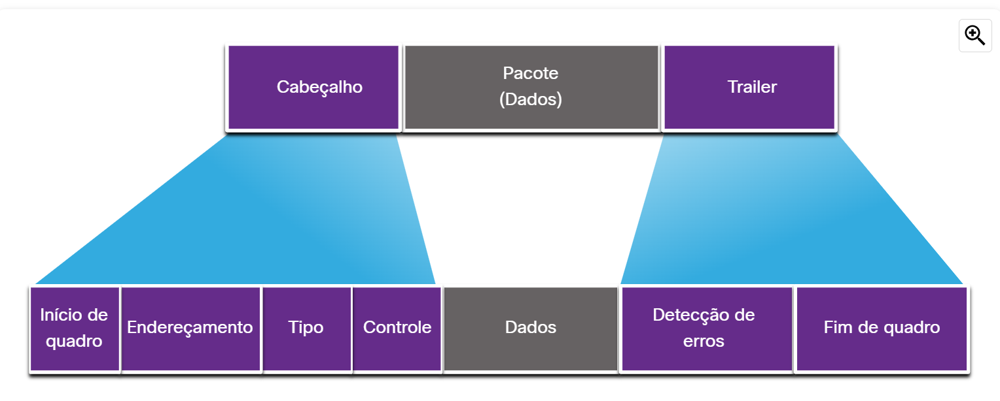

# Camada de enlace de dados

## Quadro de enlace de dados

### O quadro 

As informações anexadas nesse quadro são definidas pelo protocolo que está em uso na rede.
**A camada de link de dados prepara os dados encapsulados (geralmente um pacote IPv4 ou IPv6) para o transporte pela**
**mídia local, encapsulando-o com um cabeçalho e um trailer para criar um quadro.**
O protocolo de link de dados é responsável pela comunicação NIC para NIC dentro da rede. Embora existam diversos
protocolos diferentes que descrevem os quadros dessa camada, **todo tipo de quadro tem três partes básicas.**
* Cabeçalho;
* Dados;
* Trailer;

Diferente de outros protocolos de encapsulamento, a camada de link de dados acrescenta informações na forma de um
<mark>trailer</mark> no fim do quadro.
Os protocolos da camada de enlace encapsulam os dados no campo de dados do quadro.
A estrutura do quadro e os campos do cabeçalho e trailer variam de acordo com o protocolo. 
Em <strong>ambientes frágeis</strong>, é necessário que aja mais controles para garantir a entrega dos quadros.
Assim <strong>aumentando o tamanho do cabeçalho e do trailer</strong>

### Campos do Quadro

O enquadramento quebra o fluxo de dados em **grupos decifráveis**, as informações de controle inseridas no
cabeçalho e trailer são diferentes campos.
Assim fornecendo aos sinais físicos uma estrutura reconhecivel por nós e decodificada em pacotes de destino.
Os campos de quadro genérico são mostrados na figura. Nem todos os protocolos incluem todos esses campos. Os padrões para um protocolo de enlace de dados específico definem o formato real do quadro.

Os campos de quadro incluem o seguinte:

* **Sinalizadores de início e fim do quadro** - Usado para identificar os limites de início e fim do quadro.
* **Endereçamento** - indica os nós de origem e destino na mídia.
* **Tipo** - identifica o protocolo da camada 3 no campo de dados.
* **Controle** - Identifica serviços especiais de controle de fluxo, como qualidade de serviço (QoS). A QoS dá prioridade ao encaminhamento para certos tipos de mensagens. Por exemplo, os quadros de voz sobre IP (VoIP) normalmente recebem prioridade porque são sensíveis ao atraso.

* **Dados** - Contém a carga útil do quadro (ou seja, cabeçalho do pacote, cabeçalho do segmento e os dados).
* **Detecção de Erro** - Incluído após os dados para formar o trailer.

Os protocolos DLL acrescentam o trailer ao final do quadro, esse processo se chama <mark>detecção de erros</mark>
<strong>O trailer determina se o quadro chegou sem erros</strong>. Este coloca um resumo lógico ou matemático dos
bits que compõem o quadro no trailer. A camada de enlace adiciona essa detecção de erros pois os sinais na mídia 
podem estar sujeito a interferências, distorções ou perdas que alterariam significativamente os valores de bits 
que esses sinais representam.

Um nó de transmissão **cria um resumo lógico dos conteúdos do quadro**, conhecido como **valor de verificação de** 
**redundância cíclica (cyclic redundancy check - CRC)** Este valor é colocado no campo FCS (Sequência de Verificação de 
Quadro) para exibição ou conteúdo do quadro. No trailer Ethernet, o FCS fornece um método para o nó de recebimento 
determinar se o quadro apresentou erros de transmissão.

### Endereços da camada 2

A camada de enlace provê o endereçamento do quadro. Estes endereços são chamados de endereços físicos.
Esse endereço fica no cabeçalho do quadro, este específica o nó de destino do quadro. O cabeçalho pode ter 
támbem o enderço de origem do quadro.
Diferente dos endereços de camada 3 os endereços físicos **Não indicam em qual rede a máquina está**.
Isso ocorre pois o endereço físico é único daquele dispositivo, ou seja é uma coisa encrustada na máquina.
Os endereços da camada 2 são usados apenas para conectar  dispositivos dentro da mesma mídia, dentro da mesma
rede IP.
Conforme o pacote IP viaja do host para o roteador, de roteador para roteador e de roteador para host, em cada 
ponto ao longo do caminho, _o pacote IP é encapsulado em um novo quadro de enlace de dados_. Cada quadro de link 
de dados contém o endereço de link de dados de origem da NIC que está enviando o quadro e o endereço de link 
de dados de destino da NIC que está recebendo o quadro.
O endereço da camada de enlace **é usado apenas para entrega local**. Além da rede local esse endereços não
tem significado algum.

Caso precise passar os dados para outra parte da rede é necessário o uso de um _dispositivo intermediário_.
Assim o roteador deve aceitar o quadro baseado no endereço físico, para desencapsula-lo para examinar seu 
endereço IP. Usando endereço IP o roteador pode encontrar o dispositivo de destino e o melhor caminho para
a entrega da mensagem. Após essa análise o roteador cria um novo quadro que é enviado para o próximo
segmento de rede em direção ao destino final.

### Quadros de LAN e WAN

protocolos ethernet são usados por LANs com fio, comunicações sem fio se enquadram em WLAN(IEEE 802.11).
Protocolos antigos das WANs:

* Protocolo ponto a ponto (PPP);
* Controle de Enlace de Dados de Alto Nível (HDLC);
* Frame Relay;
* Modo de Transferência Assíncrona (ATM);
* X.25 
Estes protocolos estão sendo substituídos pela Ethernet

Cada protocolo usado na camada 2 desempenha o papel de controle de acesso ao meio. Isso significa que diversos
dispositivos de rede diferentes podem agir como nós, operando na camada de enlace de dados ao implementar esses
protocolos(**ou seja cada dispositivo pode usar um protocolo diferente**).
O protocolo usado na camada 2 é determinado pela tecnologia usada na topologia que será implementada.
A tecnologia usada é determinada pelo tamanho da rede, em termos do número de hosts e do escopo geográfico, e 
dos serviços a serem fornecidos pela rede.

LANs geralmente usam uma **tecnologia de alta largura de banda** para suportar diversos hosts. A pequena área 
geografica ocupada por uma LAN(um prédio ou um campus) junto com sua grande densidade de usuários tornam essa
tecnologia _econômica_.

Usar tecnologias de banda larga para WANs não compensão pois acaba por ***não ser econômicamente viável***.
Já que WANs abrangem grandes áreas geográficas(cidades e etc). Fazendo assim com que **o custo dos links**
**físicos de longa distância** e a tecnologia usada para transportar os sinais resultam em menor largura de banda.

A diferença de largura de banda geralmente implica no uso de diferentes protocolos.

Os protocolos da camada de enlace de dados incluem:

* Ethernet;
* 802.11 sem fio;
* Protocolo ponto a ponto (PPP);
* Controle de Enlace de Dados de Alto Nível (HDLC);
* Frame Relay.
