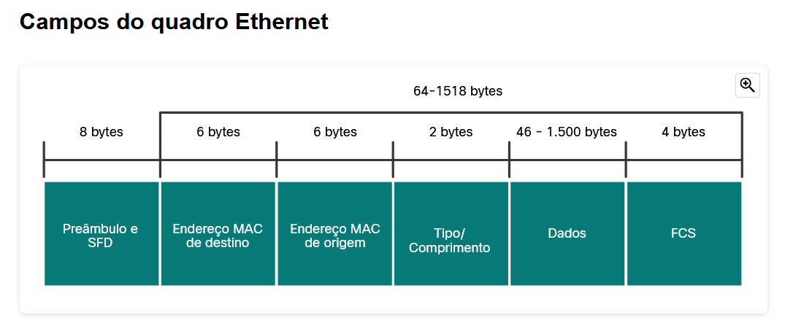
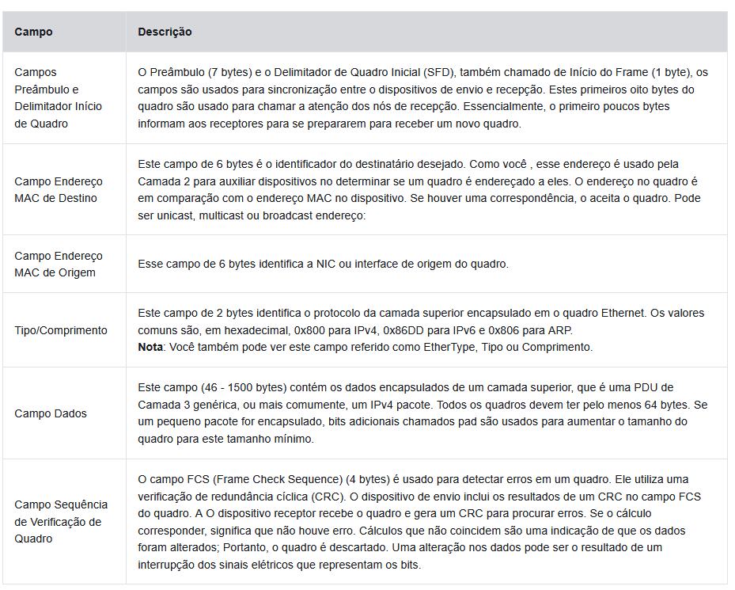
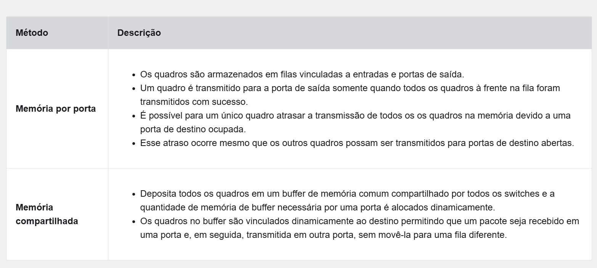
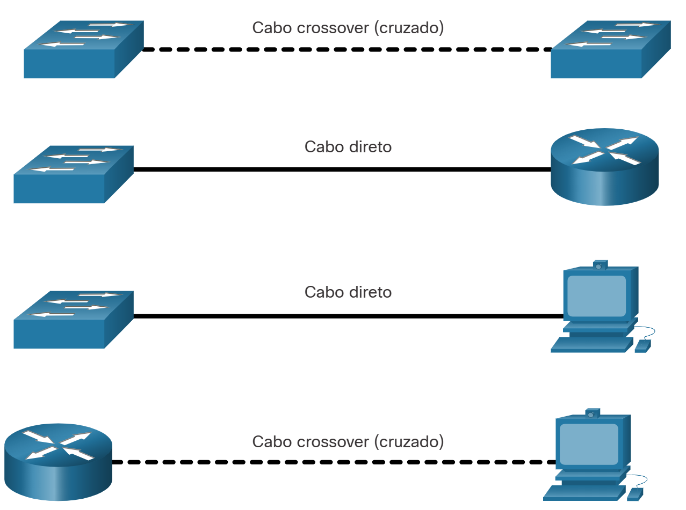

# Switching Ethernet

## Quadros Ethernet

### Encapsulamento Ethernet

A Ethernet usa comunicações com fio, utilizando par trançado, ligações de fibra óptica e cabos coaxiais.
Ela opera na camada física e na de enlace de dados. 
Larguras de banda suportadas:

* 10 Mbps
* 100 Mbps
* 1000 Mbps (1 Gbps)
* 10,000 Mbps (10 Gbps)
* 40,000 Mbps (40 Gbps)
* 100,000 Mbps (100 Gbps)

Os padrões Ethernet definem os protocolos da 2 e as tecnologias da camada 1

### Subcamadas de enlace de dados

Protocolos IEEE 802 LAN/MAN e Ethernet, operam nas seguintes duas subcamadas da camada de link de dados:
Controle de Link Lógico(LCC) e controle de acesso a mídia(MAC). 

Função do LCC e MAC na camada de link de dados:

* **Subcamada LLC** - Essa subcamada IEEE 802.2 se comunica entre o software de rede nas camadas superiores e 
o hardware do dispositivo nas camadas inferiores. Ela coloca a informação no quadro que identifica qual 
protocolo de camada de rede está sendo usado para o quadro. Essas informações permitem que vários protocolos 
da camada 3, como IPv4 e IPv6, usem a mesma interface de rede e mídia.
* **Subcamada MAC** - Esta subcamada (IEEE 802.3, 802.11 ou 802.15 por exemplo) é implementada em hardware e é 
responsável pelo encapsulamento de dados e controle de acesso a mídia. Ele fornece endereçamento de camada de 
link de dados e é integrado com várias tecnologias de camada física.

### Subcamada MAC

A subcamada MAC é **responsável pelo encapsulamento de dados e acesso à mídia**.

O encapsulamento de dados IEEE 802.3 inclui o seguinte:

* **Quadro Ethernet** - Esta é a estrutura interna do quadro Ethernet.
* **Endereçamento Ethernet** - O quadro Ethernet inclui um endereço MAC de origem e de destino para fornecer o 
quadro Ethernet da NIC Ethernet para a NIC Ethernet na mesma LAN.
* **Detecção de erro Ethernet** - O quadro Ethernet inclui um trailer de sequência de verificação de quadros (FCS) usado para detecção de erros.

### Campos de um Quadro Ethernet

O tamanho mínimo de quadro Ethernet é 64 bytes e o máximo é 1518 bytes.
Qualquer quadro com comprimento menor que 64 bytes é considerado um **"fragmento de colisão" ou um "quadro** 
**desprezível"** e é automaticamente descartado pelas estações receptoras. Quadros com mais de 1.500 bytes de 
dados são considerados ***“jumbo” ou “baby giant”***.
**Quadros com tamanhos excessivos ou abaixo do mínimo são descartados.**

## Endereços MAC de Ethernet

### Endereços MAC e hexadecimal

Um endereço MAC Ethernet consiste em um valor binário de 48 bits.
Hexadecimal é usado para identidicar endereços ethernet, é mais fácil, pois um HEX identifica quatro bits
binários.
Ao usar hexadecimal, os zeros à esquerda são sempre exibidos para concluir a representação de 8 bits. 
_Por exemplo_, o valor binário 0000 1010 é mostrado em hexadecimal como 0A.

### Endereços MAC Ethernet

O endereço MAC é usado para identificar os dispositivos físicos de origem e destino (NICs) no segmento de rede local. 
O endereçamento MAC fornece um método para identificação de dispositivo na camada de enlace de dados do modelo OSI.

**Todos os endereços MAC devem ser exclusivos do dispositivo Ethernet ou da interface Ethernet**.
Para garantir essa **EXCLUSIVIDADE** os fornecedores que vendem dispositivos ethernet fazem um registro
no IEEE onde recebem um código hexadecimal, chamado de **Identificador Exclusivo Organizacionalmente(OUI)**.

Quando um fornecedor atribui um endereço MAC a um dispositivo ou interface Ethernet, o fornecedor deve fazer o seguinte:

* Use sua OUI atribuída como os primeiros 6 dígitos hexadecimais.
* Atribua um valor exclusivo nos últimos 6 dígitos hexadecimais.

### Processamento de Quadros

Às vezes, o endereço MAC é referido como endereço gravado de fábrica (BIA, burned-in-address) porque o 
endereço é codificado na memória somente leitura (ROM) na NIC. Isso significa que o endereço é codificado no 
chip da ROM permanentemente.
Quando o computador inicia, a NIC copia o endereço MAC da ROM para a RAM.

### Endereço MAC Unicast

**Na Ethernet, se utiliza diferentes endereços MAC para comunicação unicast, broadcast e multicast da Camada 2.**
Um endereço MAC de unicast é o endereço exclusivo usado quando um quadro é enviado de um único dispositivo de 
transmissão para um único dispositivo de destino.
O processo que um host de origem usa para determinar o endereço MAC de destino associado a um endereço IPv4 é 
conhecido como ARP (Address Resolution Protocol).
O processo que um host de origem usa para determinar o endereço MAC de destino associado a um endereço IPv6 é 
conhecido como ND (Neighbour Discovery Discovery).

### Endereço MAC Broadcast

Um quadro de transmissão Ethernet é recebido e processado por cada dispositivo na LAN Ethernet. Os recursos de 
uma transmissão Ethernet são os seguintes:

* Possui um endereço MAC de destino de FF-FF-FF-FF-FF-FF em hexadecimal (48 números binários (sendo eles no valor de 0 ou 1)).
* É inundada todas as portas de switch Ethernet, exceto a porta de entrada.
* Ele não é encaminhado por um roteador.

Se os dados encapsulados forem um pacote de transmissão IPv4, isso significa que o pacote contém um endereço 
IPv4 de destino que possui todos os 1s na parte do host. Essa numeração no endereço significa que todos os 
hosts naquela rede local (domínio de broadcast) receberão e processarão o pacote.

### Endereço MAC Multicast

Um quadro de multicast Ethernet é recebido e processado por um grupo de dispositivos na LAN Ethernet que 
pertencem ao mesmo grupo de multicast. Os recursos de um multicast Ethernet são os seguintes:

* Há um endereço MAC de destino 01-00-5E quando os dados encapsulados são um pacote multicast IPv4 e um 
endereço MAC de destino de 33-33 quando os dados encapsulados são um pacote multicast IPv6.
* Há outros endereços MAC de destino multicast reservados para quando os dados encapsulados não são IP, como 
STP (Spanning Tree Protocol) e LLDP (Link Layer Discovery Protocol).
* São inundadas todas as portas de switch Ethernet, exceto a porta de entrada, a menos que o switch esteja 
configurado para espionagem multicast.
* Ele não é encaminhado por um roteador, a menos que o roteador esteja configurado para rotear pacotes multicast.

**ESPIONAGEM MULTICAST = Espionagem multicast, ou "IGMP snooping" em inglês, é uma técnica utilizada em redes** 
**de computadores para identificar grupos de dispositivos que recebem o mesmo fluxo de dados multicast**

***O intervalo de endereços multicast IPv4 é 224.0.0.0 a 239.255.255.255.***
***O intervalo de endereços multicast IPv6 começa com ff00::/8.***

Como os endereços multicast representam um grupo de endereços (às vezes chamado de grupo de hosts), eles só 
podem ser utilizados como destino de um pacote. A origem sempre será um endereço unicast.

## A tabela de endereços MAC

### Noções básicas sobre switches

O switch usa os endereços MAC para tomar decisões de encaminhamento. O switch não tem noçã quanto a
endereços IP ou ARP e etc.
**Observação: A tabela de endereços MAC às vezes é chamada de tabela de memória de conteúdo endereçável (CAM).**

### Alternar aprendizado e Encaminhamento 

O switch cria sua tabela de forma dinâmica, examinando os endereços MAC de origem dos quadros recebidos nas portas.
O switch **encaminha os quadros procurando uma correspondência** entre o endereço MAC de destino no quadro e uma 
entrada na tabela de endereços MAC.

#### O aprendizado

Todo quadro que entra em um switch é verificado quanto ao aprendizado de novas informações.
Isso é feito examinando o endereço MAC de origem do quadro e o número da porta em que o quadro entrou no comutador. 
Se o endereço MAC de origem não existe, é adicionado à tabela juntamente com o número da porta de entrada. Se o 
endereço MAC de origem existir, o switch atualizará o cronômetro de atualização para essa entrada na tabela. Por 
padrão, a maioria dos switches Ethernet mantém uma entrada na tabela por 5 minutos.

**Nota: Se o endereço MAC de origem não existir na tabela, mas em uma porta diferente, o switch tratará isso como**
**uma nova entrada. A entrada é substituída usando o mesmo endereço MAC, mas com o número de porta mais atual.**

#### O encaminhamento 

Se o endereço MAC de destino **for um endereço unicast**, o switch _procurará uma correspondência_ entre o endereço 
MAC de destino do quadro e uma entrada em sua tabela de endereços MAC. Se o endereço MAC de destino **estiver** na 
tabela, ele **encaminhará o quadro pela porta especificada**. Se o endereço MAC de destino **não estiver** na tabela, o 
switch **encaminhará o quadro por todas as portas, exceto a de entrada. Isso é chamado de unicast desconhecido**

### Filtragem de quadro

Quando o swtich possui o endereço de destino em sua tabela ele filtra o envio do quadro para apenas a porta correta.

### Tabelas de endereços MAC em switches conectados

Um switch pode ter vários endereços MAC associados a uma única porta. 
Isso é comum quando o switch está conectado a outro switch. 

### Enviando um Quadro para um gateway padrão.

Quando um dispositivo tem um endereço IP em uma rede remota, o quadro Ethernet não pode ser enviado diretamente 
para o dispositivo de destino. Em vez disso, o quadro Ethernet é enviado ao endereço MAC do gateway padrão, o roteador.

## Metodos de encaminhamento e velocidade dos swithces

### Métodos de encaminhamento de quadros em swicthes DA CISCO

Os switches usam um dos seguintes métodos de encaminhamento para o switching (comutação) de dados entre suas interfaces de rede:

* **Switching store-and-forward** - Este método de encaminhamento de quadros recebe o quadro inteiro e calcula o 
CRC. O CRC usa uma fórmula matemática, baseada no número de bits (valores 1) no quadro, para determinar se o 
quadro recebido apresenta erro. Se o CRC é válido, o switch procura o endereço de destino, que determina a 
interface de saída. Em seguida, o quadro é encaminhado para fora da porta correta.
* **Switching cut-through** - Esse método de encaminhamento de quadros encaminha o quadro antes de ser 
totalmente recebido. Pelo menos o endereço de destino do quadro deve ser lido para que o quadro possa ser encaminhado.

Caso um quadro tenha erro na verificação CRC ele será descartado. Assim diminuindo o consumo de largura de
banda por dados corrompidos.
O switch **store-and-forward** é necessário para a análise de qualidade de serviço (QoS) em redes convergentes 
onde a classificação de quadros para priorização de tráfego é necessária. Por exemplo, os fluxos de dados de voz 
sobre IP (VoIP) precisam ter prioridade sobre o tráfego de navegação na web.

### Switching Cut-Through

No switching cut-through, o switch atua nos dados assim que eles são recebidos, mesmo que a transmissão não tenha sido concluída.
O switch armazena em buffer apenas o quadro suficiente para ler o endereço MAC de destino, para que possa 
determinar para qual porta deve encaminhar os dados.
O endereço MAC de destino está localizado nos primeiros 6 bytes do quadro após o preâmbulo.

Há duas formas de switching cut-trough:

* **Comutação Fast-forward** - A comutação de avanço rápido oferece **o menor nível de latência**. e encaminha 
imediatamente um pacote depois de ler o endereço de destino. Como o switching fast-forward começa o 
encaminhamento antes de receber todo o pacote, **alguns pacotes podem ser retransmitidos com erros**. Isso ocorre 
com _pouca frequência_ e a **NIC de destino descarta o pacote com defeito após o recebimento**. No modo fast-forward, 
a latência é medida do primeiro bit recebido até o primeiro bit transmitido. Switching fast-forward é o método 
cut-through típico de switching.

* **Comutação Fragment-free** - Na alternância sem fragmentos, o switch **armazena os primeiros 64 bytes do quadro** 
antes de encaminhar. Esse tipo de switching pode ser encarado como um compromisso entre o switching 
store-and-forward e o switching fast-forward. O motivo de o switching fragment-free armazenar somente os 
primeiros 64 bytes do quadro é **que a maioria dos erros e das colisões de rede ocorre durante os primeiros 64** 
**bytes.** O switching fragment-free tenta melhorar o switching fast-forward executando uma pequena verificação de 
erros nos primeiros 64 bytes do quadro para garantir que **não ocorra uma colisão antes de encaminhar o quadro.** O 
switching fragment-free é um compromisso entre a alta latência e a alta integridade do switching 
store-and-forward e a baixa latência e a integridade reduzida do switching fast-forward.

Alguns switches são configurados para executar o switching cut-through por porta até que um limite de erro 
definido pelo usuário seja atingido e, depois, mudam automaticamente para store-and-forward. Quando a taxa de 
erros fica abaixo do limite, a porta retorna automaticamente para o switching cut-through.

### Buffers de memória em switches

Um switch Ethernet pode usar uma técnica de armazenamento de quadros em buffers antes de enviá-los. O buffer 
também pode ser usado quando a porta de destino está ocupada devido ao congestionamento. O switch armazena o 
quadro até que ele possa ser transmitido.

Como mostrado na tabela, existem dois métodos de buffer de memória:

O buffer de memória compartilhada também resulta na capacidade de armazenar quadros maiores com potencialmente 
menos quadros descartados. Isso é importante com a comutação assimétrica, que permite taxas de dados diferentes 
em portas diferentes, como ao conectar um servidor a uma porta de switch de 10 Gbps e PCs a portas de 1 Gbps.

### Configurações de interface - Velocidade e transmissão duplex

Duas das configurações mais básicas em um switch são as configurações de largura de banda (às vezes denominadas 
"velocidade") e duplex para cada porta do switch individual. 
A ***negociação automática*** é uma função opcional encontrada na maioria dos switches Ethernet e das placas de 
interface de rede (NICs). Ele permite que dois dispositivos **negociem automaticamente as melhores capacidades de** 
**velocidade e duplex.** Full-duplex será escolhido se os dois dispositivos o tiverem para a largura de banda mais alta comum entre eles.

**Observação: A maioria dos switches Cisco e NICs Ethernet é padronizada para negociação automática para** **velocidade e duplex. Portas Gigabit Ethernet só operam em full-duplex.**

**A incompatibilidade duplex é uma das causas mais comuns de problemas de desempenho nos links Ethernet 10/100** 
**Mbps. Ocorre quando uma porta no link opera em half-duplex, enquanto a outra porta opera em full-duplex.**

A incompatibilidade duplex ocorre **quando uma ou ambas as portas em um link são redefinidas e o processo de** 
**negociação automática não resulta nos dois parceiros de link com a mesma configuração.** Também pode ocorrer 
quando os usuários reconfiguram um lado de um link e esquecem de reconfigurar o outro. Os dois lados de um link 
devem estar ambos com a negociação automática ligada ou desligada. 
**A prática recomendada é configurar ambas as portas de switch Ethernet como full-duplex.**

### MDIX Automático

A maioria dos dispositivos de switch agora suporta o recurso de (Auto-MDIX) interface dependente automática. 
Quando ativado, o switch detecta automaticamente o tipo de cabo conectado à porta e configura as interfaces de acordo.
Mas o ideal é que se use o tipo correto de cabo pois o MDIX pode ser desativado.

